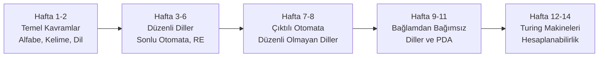
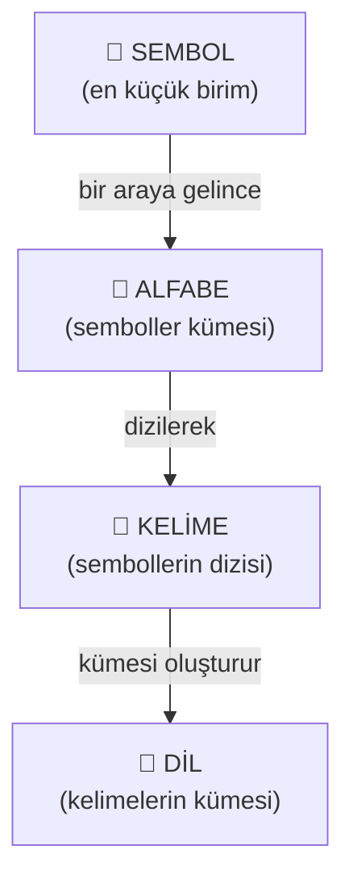
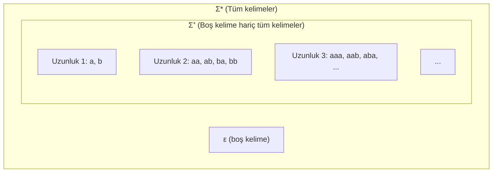
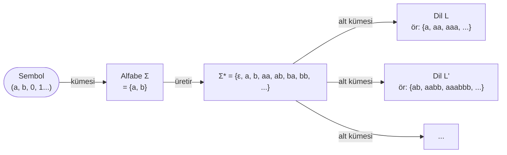
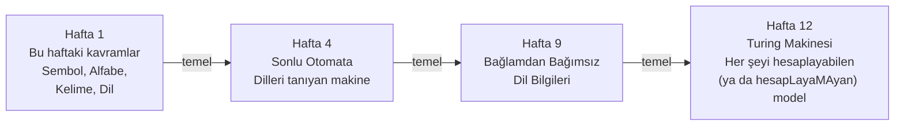

# Hafta 1: Otomata Teorisine Giriş — Alfabe, Sembol, Kelime ve Dil Kavramları


## 1. Ders Hakkında

Bilgisayar bilimine başladığınızda "program yazıyoruz, kod çalıştırıyoruz" diye öğrenirsiniz. Ama hiç şunu merak ettiniz mi?

- Bir bilgisayar **her şeyi** yapabilir mi, yoksa yapamayacağı işler var mı?
- Bir Python dosyasındaki kodu bilgisayar nasıl **anlıyor**? Kim hangi kuralı nasıl kontrol ediyor?
- Arama motorları bir kelimeyi metinde bulmak için hangi **mantığı** kullanıyor?

İşte **Otomata Teorisi ve Formal Diller** dersi tam bu soruları yanıtlar. Bu ders, hesaplamanın matematiksel temellerini inceler.

### Dersin Konuları 



### 1.1 Günlük Hayattan Bir Analoji: Kapı Güvenlik Sistemi

Bir binaya girmek için kart okuttuğunuzu düşünün. Kart okuyucu şunu yapar:
1. Kartı okur (girdi alır)
2. Kart geçerli mi diye bir kurala göre kontrol eder (hesaplama yapar)
3. Kapıyı açar veya açmaz (kabul ya da red)

Bu kart okuyucu aslında çok basit bir **otomata** (hesaplama makinesi) örneğidir. Bu derste böyle makineleri matematiksel olarak modelleyeceğiz.

---

## 2. Formal Dil Nedir? — Doğal Dille Karşılaştırma

### 2.1 Doğal Dil (Türkçe, İngilizce...)

Türkçe'de "Köpek bahçede koşuyor" cümlesi anlamlıdır. Ama "Koşuyor bahçede köpek" de —her ne kadar sıradışı olsa da— anlaşılabilir. Doğal diller **belirsizlik** barındırır, kurallar esnek ve karmaşıktır.

### 2.2 Formal Dil

Formal dil ise **matematiksel olarak kesin tanımlanmış** bir kural kümesiyle oluşturulan bir kelimeler topluluğudur. Hiç belirsizlik yoktur: bir kelime ya kurallara uygundur (dile aittir) ya da değildir.

| Özellik | Doğal Dil (Türkçe) | Formal Dil (Python) |
|---|---|---|
| Belirsizlik | Olabilir | Kesinlikle yok |
| Kurallar | Esnek, evrimleşir | Katı, değişmez |
| Anlayan | İnsan | Bilgisayar (parser) |
| Örnek | "Ali geldi" | `x = 5 + 3` |

**Formal dil örnekleri:** Python/Java/C kaynak kodu, HTML/XML belgeleri, matematiksel ifadeler, düzenli ifadeler (regex).

> **Özet:** Formal dil = Belirli bir alfabe + Kesin kurallar + Bu kurallara uyan kelimeler kümesi

---

## 3. Temel Yapı Taşları: Sembol → Alfabe → Kelime → Dil

Bu dört kavram, birbirinin üstüne inşa edilen bir hiyerarşi oluşturur. En küçükten başlayalım.



---

## 4. Sembol (Symbol) — En Küçük Birim

### Tanım
Sembol, bir alfabede yer alan ve **daha küçük parçalara bölünemeyen** temel birimdir. Tek başına bir anlam taşıması gerekmez; sadece bir işaret, bir karakter, bir nesnedir.

### Günlük Hayattan Örnekler
- Bir flaşör lambası iki sembole sahiptir: **yanık** ve **sönük**
- Bir trafik ışığı üç sembole sahiptir: **kırmızı**, **sarı**, **yeşil**
- Klavyenizdeki her tuş bir semboldür

### Matematikteki Sembollere Örnekler

| Sembol | Açıklama |
|---|---|
| `0`, `1` | İkili sayı sistemi sembolleri |
| `a`, `b`, `c` | Latin harfleri |
| `#`, `$`, `@` | Özel karakterler |
| `0`, `1`, `2`, ..., `9` | Ondalık rakamlar |

> **Dikkat:** `12` tek bir sembol **değildir**; `1` ve `2` diye iki ayrı semboldür. Semboller bölünemez atomlardır.

---

## 5. Alfabe (Alphabet) — Semboller Kümesi

### Tanım
**Alfabe**, belirli bir sistemde kullanılacak sembollerin tamamından oluşan **sonlu** ve **boş olmayan** bir kümedir. Genellikle büyük sigma harfiyle gösterilir: **Σ** (okunuş: "sigma").

> **Sonlu** olması şarttır: Sonsuz sayıda sembolden oluşan bir alfabe **tanımsızdır**.
> **Boş olmaması** şarttır: En az bir sembol bulunmalıdır.

### Alfabe Örnekleri

```
Σ₁ = {0, 1}                  → İkili (binary) alfabe (bilgisayar bellekte her şeyi böyle saklar)
Σ₂ = {a, b}                  → İki harfli basit alfabe
Σ₃ = {a, b, c, ..., z}       → İngilizce küçük harf alfabesi (26 sembol)
Σ₄ = {0, 1, 2, 3, 4, 5, 6, 7, 8, 9}  → Ondalık rakamlar alfabesi
Σ₅ = {(, )}                   → Sadece parantezlerden oluşan alfabe
```

### Sık Yapılan Hata

> Soru: Türkçe alfabesi bir alfabe midir?
>
> Cevap: Evet! Σ = {a, b, c, ç, d, e, f, g, ğ, h, ı, i, j, k, l, m, n, o, ö, p, r, s, ş, t, u, ü, v, y, z} şeklinde tanımlanırsa geçerli bir formal alfabedir. 29 elemanlı, sonlu ve boş olmayan bir kümedir.

---

## 6. Kelime / Dizi (String / Word) — Sembollerin Sıralı Dizisi

### Tanım
**Kelime** (veya **dizi**), bir alfabedeki sembollerden oluşturulan **sonlu uzunlukta sıralı bir dizidir**. Genellikle `w`, `u`, `v`, `x` gibi küçük harflerle gösterilir.

> **Sıralı** olması çok önemlidir: `ab` ile `ba` **farklı** kelimelerdir, tıpkı "arı" ve "ıra"nın farklı Türkçe kelimeler olması gibi.

### Kelime Örnekleri

Σ = {a, b} alfabesi için:

```
w₁ = a          (1 sembol)
w₂ = b          (1 sembol)
w₃ = ab         (2 sembol: önce a, sonra b)
w₄ = ba         (2 sembol: önce b, sonra a) — w₃ ≠ w₄ !
w₅ = aab        (3 sembol)
w₆ = abba       (4 sembol)
w₇ = aaabbb     (6 sembol)
```

### 6.1 Kelimenin Uzunluğu

Bir `w` kelimesinin uzunluğu, içerdiği sembol sayısıdır. **|w|** (mutlak değer notasyonu gibi) ile gösterilir.

| Kelime | Uzunluk | Hesaplama |
|---|---|---|
| `a` | 1 | 1 sembol |
| `ab` | 2 | 2 sembol |
| `abba` | 4 | 4 sembol |
| `aaabbb` | 6 | 6 sembol |
| `0110` | 4 | 4 sembol |

**Örnek:** Σ = {0, 1} için w = `0110` → |w| = 4

### 6.2 Boş Kelime (Empty String): ε

Bu kavram çok önemli ve ilk başta tuhaf gelebilir.

**Boş kelime**, içinde **hiç sembol bulunmayan** kelimedir. Matematiksel gösterimi **ε** (epsilon) harfidir.

> Analoji: Boş bir torba yine de bir torbadır. İçinde hiçbir şey olmasa da vardır. ε de bir kelimedir, sadece sıfır uzunluğundadır.

```
|ε| = 0          (boş kelimenin uzunluğu sıfırdır)
```

**ε'nun özelliği — Birim Eleman:**
Herhangi bir `w` kelimesiyle ε birleştirildiğinde kelime değişmez:

```
ε · w = w · ε = w

Örnek: ε · "abc" = "abc" · ε = "abc"
```

Bu, çarpma işlemindeki `1 sayısı` gibi davranır: `1 × sayı = sayı`.

### 6.3 Kelime Alfabenin Elemanları Dışına Çıkamaz

Σ = {a, b} ise `acd` bir kelime **değildir**; çünkü `c` ve `d` bu alfabede yoktur.

---

## 7. Kelime Üzerinde İşlemler

### 7.1 Birleştirme (Concatenation)

İki kelimeyi arka arkaya yapıştırma işlemidir. `·` veya hiçbir işaret kullanmadan yan yana yazarak gösterilir.

```
w₁ = "ab"   ,   w₂ = "ba"

w₁ · w₂ = "ab" + "ba" = "abba"
w₂ · w₁ = "ba" + "ab" = "baab"
```

> **Önemli:** Birleştirme işlemi **değişmeli (commutative) değildir!**
> w₁ · w₂ genellikle w₂ · w₁'e eşit değildir.
> ("arı" + "bal" = "arıbal") ≠ ("bal" + "arı" = "baları")

**Uzunluk özelliği:**
```
|w₁ · w₂| = |w₁| + |w₂|

Örnek: |"ab"| + |"ba"| = 2 + 2 = 4 = |"abba"| ✓
```

**ε ile birleştirme:**
```
w · ε = ε · w = w    (ε birim elemandır)
```

### 7.2 Kelimenin Tersi (Reverse)

Bir kelimenin tersini almak, sembolleri **ters sırayla** yazmak demektir. `wᴿ` ile gösterilir.

```
w = "abba"   →   wᴿ = "abba"    (palindrom! tersi kendisine eşit)
w = "abc"    →   wᴿ = "cba"
w = "0110"   →   wᴿ = "0110"    (palindrom)
w = "0100"   →   wᴿ = "0010"
```

> **Palindrom:** Tersi kendisine eşit olan kelimelere palindrom denir. "aba", "abba", "kayak" birer palindromdur.

**Özellikleri:**
```
(wᴿ)ᴿ = w                   (iki kez ters almak orijinali verir)
(w₁ · w₂)ᴿ = w₂ᴿ · w₁ᴿ    (birleştirmenin tersi, terslerin ters sırada birleşimidir)
```

### 7.3 Üs Alma (Concatenation Power)

Bir kelimeyi kendisiyle `n` kez birleştirmektir. `wⁿ` ile gösterilir.

```
w = "ab"

w⁰ = ε             (sıfır kez = boş kelime)
w¹ = "ab"          (bir kez)
w² = "abab"        (iki kez)
w³ = "ababab"      (üç kez)
```

---

## 8. Σ* ve Σ⁺ — Tüm Kelimelerin Kümesi

### 8.1 Σ* (Sigma Yıldız — Kleene Yıldızı)

**Σ\*** (okunuş: "sigma yıldız"), bir **Σ** alfabesi üzerinde oluşturulabilecek **tüm olası kelimelerin kümesidir**. Boş kelime **ε** de dahildir.

> Yıldız (*) işareti "sıfır veya daha fazla" anlamına gelir.

**Örnek:** Σ = {a, b} için Σ* şöyledir:

```
Σ* = { ε, a, b, aa, ab, ba, bb, aaa, aab, aba, abb, baa, bab, bba, bbb, ... }
       ↑     ↑         ↑                   ↑
   uzunluk 0  uzunluk 1  uzunluk 2        uzunluk 3  (sonsuza dek devam eder)
```

> **Σ\* her zaman sonsuz bir kümedir** (alfabe boş olmadığı sürece), çünkü istediğimiz uzunlukta kelime üretebiliriz.

### 8.2 Σ⁺ (Sigma Artı)

**Σ⁺**, boş kelime **ε hariç** tüm kelimelerin kümesidir.

```
Σ⁺ = Σ* \ {ε}     ("\" fark kümesi demek)
Σ* = Σ⁺ ∪ {ε}
```

### 8.3 Görsel Karşılaştırma



---

## 9. Dil (Language) — Kelimelerin Kümesi

### Tanım

**Dil**, bir **Σ** alfabesi üzerinde tanımlanmış belirli bir kuralı sağlayan kelimelerden oluşan kümedir. Matematiksel olarak:

$$L \subseteq \Sigma^*$$

Bu, "L, Σ* kümesinin bir alt kümesidir" anlamına gelir. Yani bir dildeki her kelime, Σ* içinde mutlaka bulunur.

### Dil Nasıl Tanımlanır?

Bir dil iki şekilde tanımlanabilir:

**1. Listeleyerek (sadece sonlu diller için mümkün):**
```
L = {ε, a, aa, aaa}      (tam olarak bu 4 kelimeden oluşuyor)
```

**2. Kural/Koşul vererek (hem sonlu hem sonsuz diller için):**
```
L = {w ∈ {a,b}* | w, 'a' ile başlar}
```
Okunuşu: "Σ = {a,b} üzerindeki w kelimelerinin kümesi öyle ki, w 'a' harfiyle başlıyor."  
Başka bir deyişle : "a ve b harflerinden oluşan tüm olası kelimeler arasından, 'a' ile başlayanların kümesi"  
***Not: * (Kleene yıldızı) = "bu alfabenin sembollerinden, istediğin uzunlukta, istediğin sırada kelime üret, hepsini bir araya topla.***"
### Dil Örnekleri

Σ = {a, b} için farklı diller:

```
L₁ = {}                          → Boş dil (hiç kelime yok)
L₂ = {ε}                         → Sadece boş kelimeden oluşan dil
L₃ = {a, b}                      → Sadece tek harfli kelimelerin dili
L₄ = {aa, ab, ba, bb}            → Sadece uzunluğu 2 olan kelimelerin dili
L₅ = {a, aa, aaa, aaaa, ...}     → Sadece 'a' harflerinden oluşan kelimeler
L₆ = {w | w'nin uzunluğu çifttir} → Çift uzunluklu tüm kelimeler
L₇ = Σ*                          → Tüm kelimeler (en büyük dil)
```

### Önemli Ayrım: Boş Dil ∅ ile {ε} Farkı

Bu ayrım çok önemlidir ve sıklıkla karıştırılır:

| | Boş Dil ∅ | {ε} Dili |
|---|---|---|
| Tanım | Hiç kelime içermeyen dil | Sadece boş kelimeyi içeren dil |
| Eleman sayısı | 0 | 1 |
| Eleman | — | ε |
| Analoji | Boş bir kitaplık | İçinde boş bir sayfa olan kitaplık |

---

## 10. Büyük Resim: Kavramlar Arasındaki İlişki



> **Özet ilişki:** Semboller → Alfabe → Tüm kelimeler kümesi Σ* → Dil (Σ*'ın bir alt kümesi)

---

## 11. Neden Bu Kavramlar Önemli?

Bu soyut kavramların neden öğretildiğini somutlaştıralım:

### 11.1 Derleyici (Compiler) Örneği

Bir Python programı yazıp çalıştırdığınızda arka planda şunlar olur:

```
Kaynak kod (string)
      ↓
  [Lexer] — Kelimelere ayırır: "if", "x", "==", "5"
      ↓
  [Parser] — Gramer kurallarına uygun mu diye kontrol eder
      ↓
  [Anlam Analizi] — Tip uyumu vb.
      ↓
  Çalıştırılabilir kod
```

Lexer ve Parser, tam olarak bu derste öğrendiğimiz **formal dil ve otomata** kavramları üzerine kuruludur.

### 11.2 Regex (Düzenli İfade) Örneği

Bir metin editöründe `Ctrl+F` ile arama yaptığınızda ya da kodda `re.match(r'\d+', text)` gibi bir ifade kullandığınızda, arka planda çalışan mekanizma bu dersin **3. haftasında** göreceğimiz **sonlu otomata** yapısıdır.

### 11.3 Dersin İlerleyen Haftaları



---

## 12. Adım Adım Çözümlü Örnekler

### Örnek 1 — Alfabe ve Uzunluk Belirleme

> **Soru:** Σ = {0, 1, 2} ve w = "2010" için |w| nedir? w ∈ Σ* mıdır?

**Çözüm:**
- w = "2010" kelimesindeki semboller: 2, 0, 1, 0
- |w| = 4 (4 sembol var)
- w'deki tüm semboller (0, 1, 2) Σ içinde mi? Evet. Dolayısıyla **w ∈ Σ*** ✓

---

### Örnek 2 — Alfabeye Ait Olmayan Kelime

> **Soru:** Σ = {a, b} için w = "abc" bir kelime midir?

**Çözüm:**
- w = "abc" içindeki semboller: a, b, c
- 'c' sembolü Σ = {a, b} içinde **yoktur**
- Bu nedenle w = "abc", Σ üzerinde tanımlı bir kelime **değildir**. w ∉ Σ* ✗

---

### Örnek 3 — Birleştirme İşlemi

> **Soru:** w₁ = "aba" ve w₂ = "ba" için w₁ · w₂ ve w₂ · w₁ nedir?

**Çözüm:**
```
w₁ · w₂ = "aba" + "ba" = "ababa"       |w₁ · w₂| = 3 + 2 = 5
w₂ · w₁ = "ba"  + "aba" = "baaba"      |w₂ · w₁| = 2 + 3 = 5
```
Uzunlukları aynı ama içerikleri farklı: "ababa" ≠ "baaba"

---

### Örnek 4 — Kelimenin Tersi

> **Soru:** w = "abcba" için wᴿ nedir? Palindrom mu?

**Çözüm:**
```
w  = a b c b a
wᴿ = a b c b a   (ters sıraya dizeriz)
```
wᴿ = w olduğu için **"abcba" bir palindromdur** ✓

---

### Örnek 5 — Dile Ait Olup Olmadığını Kontrol Etme

> **Soru:** Σ = {0, 1} ve L = {w | w eşit sayıda 0 ve 1 içerir} dili için aşağıdakilerden hangisi L'ye aittir?
> a) "0011"  b) "010"  c) "0101"  d) ε

**Çözüm:**
```
a) "0011": iki 0, iki 1 → Eşit sayıda → L'ye AİT ✓
b) "010":  iki 0, bir 1 → Eşit değil → L'ye AİT DEĞİL ✗
c) "0101": iki 0, iki 1 → Eşit sayıda → L'ye AİT ✓
d) ε:      sıfır 0, sıfır 1 → 0 = 0, eşit → L'ye AİT ✓
```

---

### Örnek 6 — Σ* İçin Kelime Sayısını Anlama

> **Soru:** Σ = {a, b} için uzunluğu tam olarak 3 olan kaç farklı kelime vardır?

**Çözüm:**
Her pozisyon için 2 seçenek (a veya b) vardır ve 3 pozisyon var:

```
2 × 2 × 2 = 2³ = 8 kelime

aaa, aab, aba, abb, baa, bab, bba, bbb
```

Genel kural: |Σ| = k alfabe için uzunluğu tam n olan kelime sayısı = **kⁿ**

---

## 13. Özet Tablosu

| Kavram | Formal Gösterim | Açıklama | Örnek (Σ = {a,b}) |
|---|---|---|---|
| Sembol | a, b, 0, 1, ... | Bölünemeyen en küçük birim | `a`, `b` |
| Alfabe | Σ | Sonlu, boş olmayan sembol kümesi | {a, b} |
| Boş kelime | ε | Sıfır uzunluklu kelime | ε |
| Kelime / Dizi | w, u, v | Sembollerin sonlu sıralı dizisi | "ab", "bba" |
| Uzunluk | \|w\| | Kelimedeki sembol sayısı | \|"ab"\| = 2 |
| Tüm kelimeler | Σ* | Σ üzerindeki tüm kelimelerin kümesi (ε dahil) | {ε, a, b, aa, ...} |
| Boş olmayan tüm kelimeler | Σ⁺ | Σ* \ {ε} | {a, b, aa, ab, ...} |
| Dil | L ⊆ Σ* | Belirli kurallara uyan kelimelerin kümesi | {aa, bb, aabb, ...} |
| Boş dil | ∅ | Hiç kelime içermeyen dil | ∅ |

---

## 14. Alıştırma Soruları

### Temel Düzey

1. Σ = {x, y} için uzunluğu 3 olan **tüm** kelimeleri listeleyiniz. (Kaç tane olduğunu tahmin edin, sonra listeleyerek doğrulayın.)

2. Aşağıdaki ifadelerden hangisi doğrudur? Yanlış olanları düzeltin.
   - a) ε = {} (boş küme ile boş kelime aynı şeydir)
   - b) |ε| = 0
   - c) "ab" ∈ {a, b}* (Σ = {a, b})
   - d) "ac" ∈ {a, b}*

3. w = "kayak" için wᴿ nedir? Palindrom mu?

### Orta Düzey

4. Σ = {0, 1} ve L = {w | w çift sayıda 1 içerir} için aşağıdaki kelimelerin L'ye ait olup olmadığını belirleyiniz:
   - a) `00`  b) `101`  c) `1100`  d) `ε`  e) `111`

5. w₁ = "ab", w₂ = "ba" için şunları hesaplayınız:
   - a) w₁ · w₂
   - b) w₂ · w₁
   - c) w₁²  (w₁ · w₁)
   - d) (w₁ · w₂)ᴿ

6. Σ = {a, b} üzerinde tanımlanmış L = {aⁿbⁿ | n ≥ 0} dili nedir? İlk 5 elemanını yazınız.
   *(Not: aⁿbⁿ ifadesi, "n tane a ve ardından n tane b" demektir.)*

### İleri Düzey

7. Σ = {0, 1} için |Σ*| (Σ*'ın eleman sayısı) neden **sonsuz** ama |Σ| (alfabenin eleman sayısı) **sonlu**dur? Açıklayınız.

8. Σ = {a} için Σ* kümesinin tüm elemanlarını yapısına bakarak tanımlayınız.

9. L₁ ve L₂ iki dil olsun. L₁ ∪ L₂, L₁ ∩ L₂ ve L₁ · L₂ (dillerin birleşimi/kesişimi/çarpımı) ne anlama gelir? Kendi örneklerinizle açıklayınız.

---

## 15. Sık Sorulan Sorular (SSS)

**S: ε neden önemli? Gerçek hayatta karşılığı var mı?**
C: Evet. Örneğin bir arama motoru boş sorgu girişini (`""`) özel bir durum olarak işler. Regex'te boş eşleşme önemlidir. Derleyicilerde "sıfır token" durumu vardır. ε bunların hepsinin matematiksel modelidir.

**S: Σ* neden sonsuz?**
C: Çünkü herhangi bir uzunlukta kelime üretebiliriz. Uzunluk 1, 2, 3, 4, ... için her zaman kelime vardır ve bu sonsuza kadar devam eder.

**S: Her küme bir dil midir?**
C: Hayır. Sadece bir **Σ** alfabesi üzerinde tanımlanan kelimeler kümesi dil olabilir. Yani L ⊆ Σ* olmalıdır. "Tüm doğal sayılar kümesi" kendi başına bir dil değildir; ama sayıları temsil eden karakter dizileri kümesi bir dil olabilir.

**S: Dil sonsuz olabilir mi?**
C: Kesinlikle. Hatta çoğu ilginç dil sonsuzdur. Örneğin Python programlarının kümesi sonsuzdur — istediğimiz kadar uzun program yazabiliriz.
