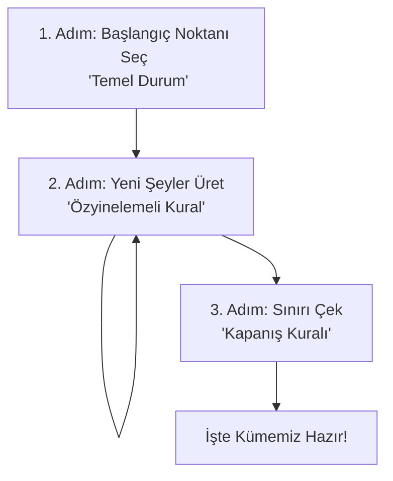
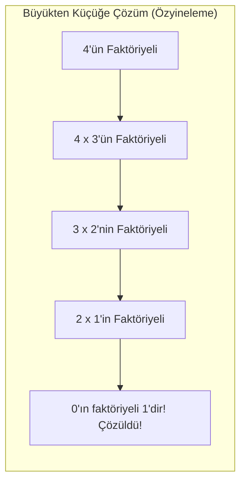

# Hafta 2: Özyinelemeli (Kendi Kendini Tekrar Eden) Tanımlar

## 1. Nedir Bu Özyineleme (Recursion)?
Özyineleme, karmaşık veya büyük bir problemi **kendi içindeki daha küçük ve basit kopyalarını kullanarak** çözme yöntemidir. 

Bunu anlamanın en kolay yolu **"Karanlık Sinema Kuyruğu"** örneğidir:
Karanlık bir sinema salonunda bir kuyruktasınız ve **kaçıncı sırada oturduğunuzu bilmiyorsunuz**. Öğrenmek için önünüzdeki kişiye *"Sen kaçıncı sıradasın?"* diye sorarsınız. O kişi de bilmediği için kendi önündekine sorar. Bu soru zinciri en öndeki (1. sıradaki) kişiye kadar elden ele gider.

* En öndeki kişi arkasına dönüp *"Ben 1. sıradayım!"* der. **(İşte bu Temel Durumdur. Başlangıç noktasıdır ve cevabı kesindir.)**
* Sonraki herkes, bir öncekinin söylediği sayıya 1 ekleyerek kendi numarasını bulur ve arkasındakine söyler: *"O 1 ise ben 2'yim", "O 2 ise ben 3'üm"* diyerek size kadar gelir. **(İşte bu Özyinelemeli Kuraldır. Aynı işlem sürekli adım adım tekrar edilir.)**

Bir matematiksel veya mantıksal tanımın "özyinelemeli" olabilmesi için **3 altın kurala** ihtiyacı vardır:

1. **Temel Durum (Başlama / Durma Noktası):** Daha fazla parçalanamayan, en basit, cevabı net olarak bilinen başlangıç noktasıdır. Örn: "İlk sıradaki kişinin numarası 1'dir."
2. **Özyinelemeli Kural (Tekrar Kuralı):** Bir önceki adımdaki malzemeyi/bilgiyi kullanarak bir sonrakini üretme formülüdür. Örn: "Benim sıram = (Önümdeki kişinin sırası) + 1"
3. **Kapanış Kuralı (Sınır Çizgisi):** Sistemin sınırlarını çizer. "Sadece bu kurallarla oluşturulan şeyler gruba dahildir, dışarıdan başka hiçbir şey kabul edilemez" der.

---

## 2. En Basit Örnek: Doğal Sayılar Nasıl Oluşur?
Sadece 0'ı bilerek tüm doğal sayıları sonsuza kadar tanımlayabiliriz:
* **Temel Durum:** 0 bir doğal sayıdır.
* **Kural:** Eğer elinde bir doğal sayı varsa ('n' diyelim), bunun bir fazlası ('n+1') da doğal sayıdır.
* **Kapanış:** Bu kuralın ürettikleri dışında doğal sayı yoktur.
*(Sıfırdan başlarız, kuralı işleterek 1'i buluruz. 1'i kurala sokup 2'yi buluruz...)*

---

## 3. Kelime Üretme Fabrikası: Σ* (Tüm Kelimeler Kümesi)
Alfabemizdeki harfleri ucu ucuna ekleyerek kelimeler oluşturduğumuzu düşünelim:
* **Temel Durum:** "Boş kelime" ($\varepsilon$) bir kelimedir. (Hiç harf içermeyen kelime)
* **Kural:** Eğer elinizde geçerli bir kelime varsa ve yanına alfabeden yeni bir harf eklerseniz, o da geçerli bir kelimedir.
* **Kapanış:** Başka şekilde kelime oluşturulamaz.

---

## 4. Tane Tane Pratik Örnekler

**Örnek 1 — Faktöriyel (Matematikte Çarpım Zinciri)**
Faktöriyel geriye dönük çarpmaktır (4! = 4x3x2x1). Özyinelemeli olarak şöyle anlatılır:
* **Başlangıç:** 0'ın faktöriyeli 1'dir. `fact(0) = 1`
* **Kural:** Herhangi bir sayının faktöriyeli = Kendisi çarpı bir eksiğinin faktöriyeli. `fact(n) = n * fact(n-1)`

**Örnek 2 — Sadece "Çift Uzunluklu" Kelimeler Üretmek**
* **Başlangıç:** İçinde hiç harf olmayan boş kelime ($\varepsilon$) çift uzunluktur (0 harf).
* **Kural:** Elimizdeki çift uzunluklu bir kelimenin, hem sağına hem soluna birer harf eklersek, uzunluğu 2 artar ve yine çift uzunluklu olur!

**Örnek 3 — Tersten de Aynı Okunan Kelimeler (Palindrom: "KÜTÜK" gibi)**
* **Başlangıç:** Boş kelime ($\varepsilon$) veya tek harfli kelimeler ("a", "b") palindromdur.
* **Kural:** Bir palindrom kelimenin **hem başına hem sonuna aynı harfi** koyarsan yeni bir palindrom üretirsin. (Örn: "a"nın başına ve sonuna "b" koy: "bab" olur).

---

## 5. Özyineleme (Kendi Kendini Çağırma) vs Döngü Karşılaştırması
* **Döngü (İteratif):** Bir işlemi "şart sağlanana kadar tekrarla" der. İleriye doğru adım adım gider. (1'den n'e kadar sayıp çarp).
* **Özyineleme (Recursive):** Büyük problemi alır, sürekli daha küçük problemlere parçalar. En küçük parçayı (Temel Durumu) çözdüğünde tüm parçalar domino taşı gibi birbirini çözer.

---

## 6. Pratik Yapalım (Alıştırmalar)
Öğrendiklerimizi test etmek için kendinize şu soruları sorun:
1. İçinde sadece tek bir sayıda 'a' harfi olan kelimeleri nasıl bir kural ile üretiriz?
   * **Cevap:** 
     * **Temel Durum:** Sadece `"a"` kelimesi geçerli bir kelimedir.
     * **Özyinelemeli Kural:** Eğer elinizde geçerli bir kelime varsa (içinde zaten bir tane 'a' olan), bu kelimenin başına veya sonuna 'a' haricindeki herhangi bir harfi (örn: 'b', 'c') eklerseniz oluşan yeni kelime de geçerlidir.
     * **Kapanış:** Sadece bu yolla üretilen kelimeler geçerlidir.
2. 2'nin kuvvetleri şeklinde artan diziyi ($2^0, 2^1, 2^2...$) nasıl tanımlarız? *(İpucu: Sürekli 2 ile çarpmak)*
   * **Cevap:**
     * **Temel Durum:** Dizinin ilk ve en küçük elemanı $1$'dir.
     * **Özyinelemeli Kural:** Eğer $x$, bu diziye ait geçerli bir elemansa, $2x$ (yani $x$'in 2 ile çarpımı) de bu diziye aittir.
     * **Kapanış:** Bu kuralın ürettiği sayılar dışında hiçbir sayı diziye ait değildir.
3. Bir alfabede "Sadece 0 ile başlayan" kelimeleri üreten başlangıç ve kural nedir?
   * **Cevap:**
     * **Temel Durum:** Sadece `"0"` kelimesi geçerli bir kelimedir. (Böylece 0 ile başladığını garanti etmiş oluruz.)
     * **Özyinelemeli Kural:** Eğer elinizde geçerli (yani zaten 0 ile başlayan) bir kelime varsa, bu kelimenin **sadece sonuna (sağ tarafına)** alfabeden herhangi bir harfi eklerseniz, oluşan yeni kelime de geçerli olur.
     * **Kapanış:** Sadece bu kuralla üretilen kelimeler geçerlidir.
4. **Kendi Öğrenci Numaranızla Özyineleme**
   * Sadece size özel olan bu soruyu kağıt üzerinde çözünüz: Öğrenci numaranızın **son iki hanesini** başlangıç değeri (Temel Durum) olarak kabul edin. Bu değere her adımda **öğrenci numaranızın ilk hanesini** ekleyen bir özyinelemeli kural yazın. 
   * *Örnek:* Numaranız **3**4501**99** ise; Başlangıç: 99. Kural: Sonraki sayı = Önceki sayı + 3. (Dizi: 99, 102, 105...)
   * *Soru:* Bu diziyi üreten Temel Durumu, Özyinelemeli Kuralı ve Kapanış Kuralını resmi formda ifade ediniz. İşlemin ilk 3 adımını yazarak gösteriniz.
5. **Kendi Adınızla Kelime Üretme (Özyineleme)**
   * Öğrenci numaranıza ek olarak, kendi adınızı temel alarak bir özyinelemeli kelime üretme kuralı oluşturun.
   * **Görev:** Temel durum olarak **adınızın ilk harfini** alın. Özyinelemeli kural olarak, mevcut kelimenin **hem başına hem de sonuna adınızın son harfini** ekleyin.
   * *Örnek:* Adınız "AHME**T**" ise; 
     * Başlangıç: "A"
     * 1. Adım: "TAT" (Başına ve sonuna T eklendi)
     * 2. Adım: "TTATT"
   * *Soru:* Kendi adınız için Temel Durumu, Özyinelemeli Kuralı ve Kapanış Kuralını yazınız. Kuralınızı işleterek oluşan ilk 3 kelimeyi listeleyiniz.
