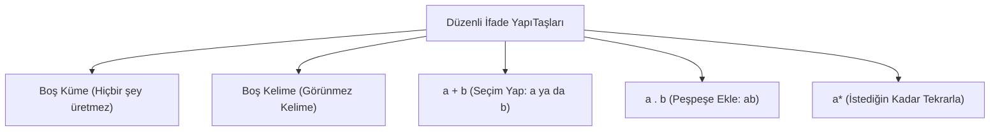

# Hafta 3: Düzenli İfadeler (Pattern Eşleştirme)

## 1. Düzenli İfade Nedir?
Düzenli ifadeler (Regular Expressions veya kısaca Regex), metinler içinde belirli **kalıpları (pattern)** bulmamızı sağlayan formüllerdir. İnternette bir kelime ararken "içinde 'ab' geçen kelimeleri bul" diyorsak, işte bu kuralları yazmanın matematiksel yoludur.

## 2. Kullanacağımız Temel Araçlar (Operatörler)
Kelimeleri üretirken veya ararken şu basit kuralları kullanırız:

| İşaret / Operatör | Görevi | Basit Anlatım ve Örnek |
|---|---|---|
| **`+`** veya **`\|`** | **VEYA (Seçim)** | İki seçenekten sadece birini seçmenizi söyler. Örnek: `a + b` demek, "Ya 'a' olsun, ya da 'b' olsun" demektir. |
| **Yanyana Yazmak** | **BİRLEŞTİRME (Sıralama)** | Harflerin arka arkaya kesin bir sırayla gelmesi gerektiğini belirtir. Örnek: `ab` demek, "Önce 'a' gelsin, hemen ardından 'b' gelsin" demektir. |
| **`*` (Yıldız)** | **İSTEDİĞİN KADAR (Boşluk Dahil)** | İlgili harfin hiç gelmeyebileceğini (boş kelime) veya sonsuz kez art arda gelebileceğini söyler. Örnek: `a*` demek, "Hiç yok, a, aa, aaa..." demektir. |
| **`+` (Artı)** | **EN AZ BİR TANE (Boşluk Hariç)** | İlgili harfin kesinlikle en az bir kez olması gerektiğini, sonrasında sınırsız tekrarlanabileceğini söyler. Örnek: `a+` demek, "a, aa, aaa..." demektir. (Hiç olmama durumu yoktur).

> **Aklınızda Bulunsun:** Matematiksel formal dillerde `+` işareti çoğunlukla "VEYA" analamında (`a + b`) kullanılır. Harfin tepesine yazıldığında ise (`a+`) "en az bir tane" anlamına gelir.

## 3. En Temel Yapılar: Sözlüğümüz
- **$\emptyset$ (Boş Küme):** Hiçbir şey yok. İçi boş bir kutu.
- **$\varepsilon$ (Boş Kelime):** Kutu var ama içinde karakter yok. Görünmez kelime (uzunluğu sıfır).
- **a:** Alfabedeki tek bir harfin aynen yazılmasıdır.

## 4. Tane Tane Pratik Örnekler

**Örnek 1 — Seçim Yapmak (Veya):**
`a + b` $\rightarrow$ Makine sadece iki harf üretebilir: Ya `a` ya da `b`.

**Örnek 2 — Yıldız Gücü (Tekrar):**
`a*` $\rightarrow$ Hiç seçmeyebilirsin ($\varepsilon$), bir kere seçebilirsin (a), iki kere (aa), beş kere (aaaaa)...

**Örnek 3 — Sabit Bitişli Kelimeler:**
`(a+b)*abb` $\rightarrow$ Burayı ikiye bölelim:
1. `(a+b)*`: "a ve b'leri kullanarak istediğin karmaşayı yarat, uzunluğu kalıbı fark etmez."
2. `abb`: "...Ama en sonunda kelime MUTLAKA 'abb' ile btsin."
Ürettikleri: abb, aabb, babb, ababababb... (Hepsi abb ile biter).

**Örnek 4 — Başı ve Sonu Sabit, Ortası Karışık:**
`a(a+b)*b` $\rightarrow$
1. Kelime kesinlikle `a` ile başlar.
2. Ortada istediğin kadar a ve b olur: `(a+b)*`.
3. Kelime kesinlikle `b` ile biter.
Ürettikleri: ab (ortası boş), aab, abb, aababab...

---

## 5. Matematik Kuralları Gidi Basit Kurallar
- `r + r = r` (Aynı şeyi veya ile eklersen değişmez. Örn: "Elma veya Elma" yine = Elma)
- `a + b = b + a` (Seçeneklerin sırası önemli değildir)
- Boş kelimeyi neyle çarparsan yine kendisi olur.

---

## 6. Sırada Ne Var?
Düzenli ifadeler ile kurallarımızı kâğıda yazdık. "Kelimenin içinde ab geçsin" dedik. Peki ama *buna kim bakıp kontrol edecek?* Bu kuralların doğru çalışıp çalışmadığını adım adım test edecek bir "makineye" ihtiyacımız var mı?
*Evet!*
İşte bu makinenin adı **Sonlu Otomata (Finite Automata)'dır**. Hafta 4'te bu kuralları anlayan makineleri yapmayı öğreneceğiz!
