# Hafta 4: Sonlu Otomata (Kelimeleri Kontrol Eden Makineler)

## 1. Giriş: Otomata Nedir?
Bir önceki hafta (Hafta 3), kelimeleri nasıl üreteceğimizi "Düzenli İfadeler (Regex)" ile kağıda formül olarak yazmıştık. Örneğin `a*b` demiştik. 

**Sonlu Otomata**, bu yazdığımız kuralların doğru çalışıp çalışmadığını test eden **hayali makinelerdir**. 
Bu makineye bir kelime verirsiniz. Makine kelimeyi harf harf okur ve sonunda size tek bir cevap verir: **"KABUL"** veya **"RET"**.
Eğer kelime kurallara (formüle) uyuyorsa kabul eder, uymuyorsa reddeder.

Bunun için 5 şeye ihtiyaç vardır:
1. **Durumlar (Q):** Makinenin o an nerede olduğu, hafızası.
2. **Alfabe (Σ):** Hangi harfleri okuyabileceği (örn: a, b, 0, 1).
3. **Geçiş Fonksiyonu ($\delta$):** Hangi durumdayken hangi harfi okursak nereye gideceğimizi söyleyen yön tabelaları.
4. **Başlangıç Durumu ($q_0$):** Makinenin çalışmaya başladığı ilk nokta.
5. **Kabul Durumları ($F$):** Kelime bittiğinde makine bu noktalardan birindeyse kelime başarılıdır!

---

## 2. Deterministik Sonlu Otomata (DFA)

**DFA (Kesin Kararlı Makine):** Adındaki "Deterministik" kelimesi "Belirlenmiş / Kesin" anlamına gelir. DFA, en ufak bir kafa karışıklığı yaşamaz. Her durumda, alfabedeki **her harf için sadece ve kesinlikle tek bir yol (geçiş)** vardır. Asla sürpriz yapmaz.

### DFA Örnekleri ve Tasarımları

**Diyagramlardaki Şekillerin Anlamı (Görsel Kılavuz):**
Otomata çizimleri okurken şu evrensel standartlar geçerlidir:
1. **Başlangıç Durumu (Start):** Başka bir durumdan değil, diyagramın dışından "boşluktan" gelen bir ok ile gösterilir. (Çizimlerdeki `start --> q0` oku). Makine çalışmaya buradan başlar.
2. **Normal Durum:** Tek çizgili yuvarlak daireler ile gösterilir (Örnek: `(q1)`). Makinenin kelimeyi okurken gezindiği ara duraklardır.
3. **Kabul Durumu (Final/Accept):** İç içe çizilmiş **Çift Daire** ile gösterilir (Örnek: `((q3))`). Makinenin amacı kelime sonlandığında bu çift dairede bulunabilmektir.

**Örnek 1 — "Çift Sayıda 'a'" İsteyen DFA Makinesi:**
Makinenin amacı: "Bana istediğin kadar b harfi gönder umurumda değil. Ama a'ları sayarım. Toplam a sayısı çift olmalı."
* $q_0$: Çift sayıda 'a' gördüm (Başlangıç ve KABUL durumu). Sıfır tane 'a' da çift kabul edilir.
* $q_1$: Tek sayıda 'a' gördüm (Bekleme odası).
* **Çalışma Mantığı:** 'a' gelirse bir duruma geçer. Tekrar 'a' gelirse asıl duruma döner (çiftlemiş olur). 'b' gelirse olduğu yerde kalır.

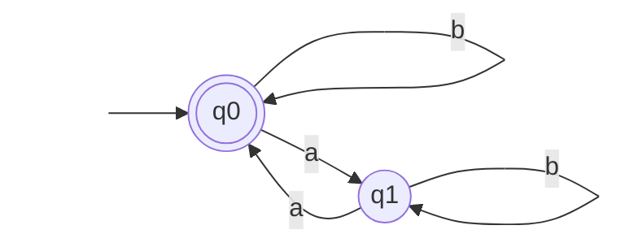
*Not: Bu örnekte $q_0$ hem başlangıç hem de kabul durumudur.*

**Örnek 2 — Kesinlikle "ab" ile Bitenleri İsteyen Makine:**
Amacımız: Son iki harf "...ab" olmalı. (Önden ne gelirse gelsin)
* Makine başlangıçta ($q_0$) sakince bekler.
* 'a' gördüğünde umutlanır ve tetikte bekler ($q_1$).
* 'a'dan hemen sonra 'b' gelirse zafer kutlar ($q_2$). Ancak ardından başka harf gelirse geri döner.

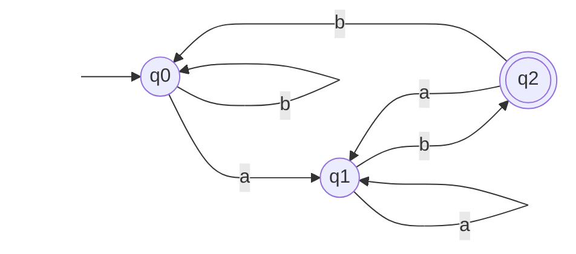

**Örnek 3 — Sadece ve Tam Olarak "01" Kelimesini Kabul Eden Makine (Ölü Durum):**
Amacımız: Ne eksik ne fazla, kelime sadece "01" olmalıdır. 
* Makinemiz çok katıdır. Eğer başta '1' gelirse veya kelime "01" olduktan sonra başka bir harf gelirse kelime sonsuza kadar reddedilir.
* Bu "kaçış olmayan ret durumuna" **Ölü Durum (Trap State)** denir.

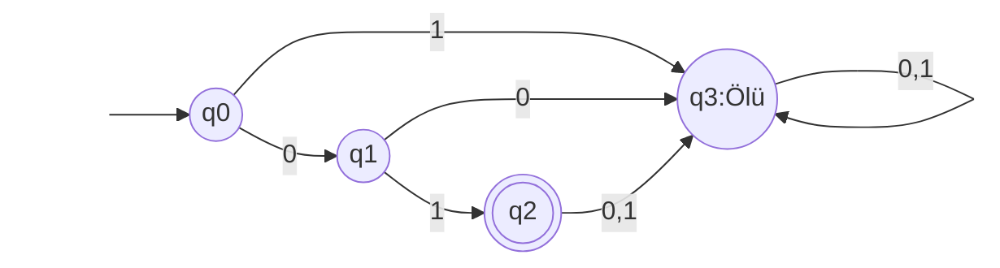

**Örnek 4 — 'b' ile Başlayan Kelimeleri Kabul Eden Makine:**
Amacımız: İlk harf 'b' olsun, sonrasında ne gelirse gelsin.
* Başlangıçta 'b' gelirse hemen zafer ilan ederiz ve bir daha oradan çıkmayız.
* 'a' gelirse makine küser ve ölü duruma geçer.

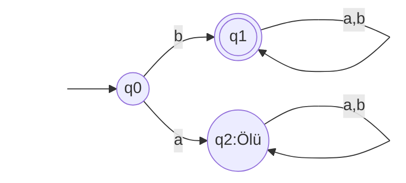

**Örnek 5 — İçinde Mutlaka "aba" Kelimesi Geçen Makine:**
Amacımız: Kelimenin herhangi bir yerinde "aba" geçmesi yeterlidir. 
* Makine kelimenin içinde "aba" yakalayana kadar harflerin izini sürer, geldiği yeri unutmaz.

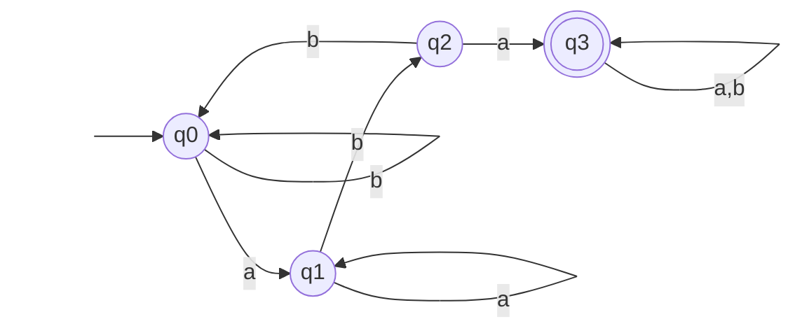

### Çözümlü DFA Sınav Örnekleri

**Çözümlü Örnek 1 (Başlangıç-Bitiş Şartı):** $\Sigma = \{a, b\}$ alfabesinde, 'a' harfi ile başlayıp 'b' harfi ile biten kelimeleri kabul eden DFA'nın durum diyagramını çiziniz. *(Örn: ab, aab, abb onaylanır; ba, aa reddedilir.)*

**Çözüm 1:** Makine 'a' ile başlamazsa anında "Ölü" duruma gitmelidir. 'a' ile başladıktan sonra kelimenin 'b' ile bittiğinden emin olmak için son harf 'b' ise kabul durumunda beklemeli, 'a' gelirse kabulden çıkmalıdır.
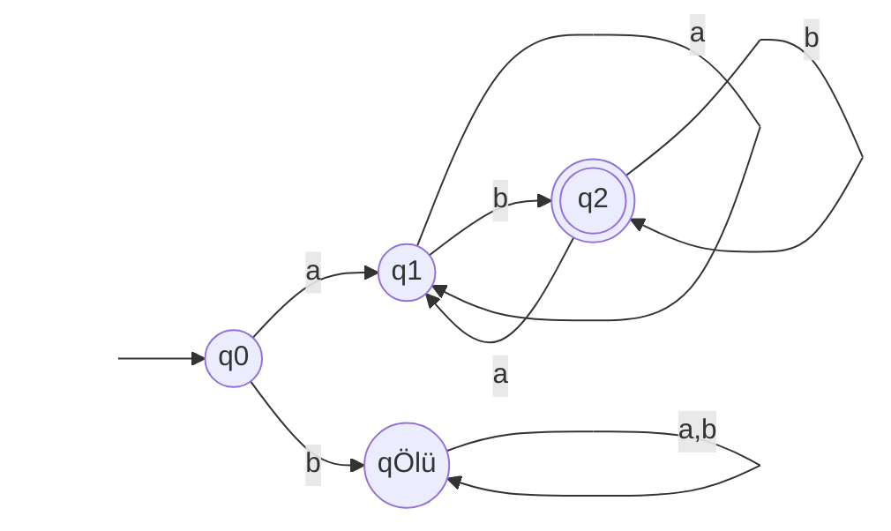

**Çözümlü Örnek 2 (Alt Kelime Yakalama - Ölü Durumsuz):** $\Sigma = \{0, 1\}$ alfabesinde, içinde ardışık olarak "11" geçen kelimeleri tanıyan DFA'yı çiziniz.

**Çözüm 2:** Hedef dizi boyunca harfler okunur, "11" art arda yakalandığı an kabul durumuna (*q2*) varılır. Sorudaki bilgiye göre 11 geçmesi yettiği için o andan sonra gelecek harfler başarıyı bozmaz.
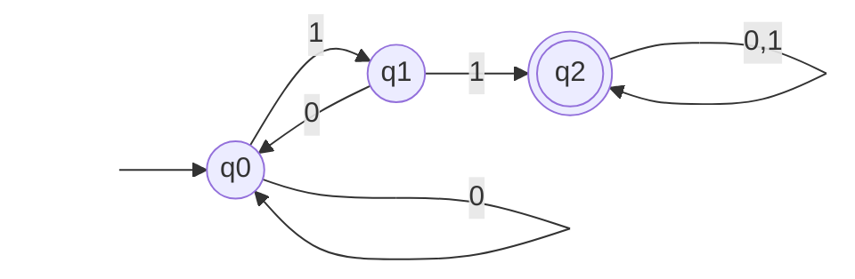

**Çözümlü Örnek 3 (Tablo Okuma ve Yazma):** 2. soruda çizdiğiniz "içinde 11 geçen makine" DFA'sının geçiş tablosunu (transition table) oluşturunuz.

**Çözüm 3:**
| O Anki Durum | '0' Okunursa | '1' Okunursa |
|---|---|---|
| **$\rightarrow q_0$** (Başlangıç) | $q_0$ | $q_1$ |
| **$q_1$** (Tek 1) | $q_0$ | $q_2$ |
| **$*q_2$** (Kabul) | $q_2$ | $q_2$ |

**Çözümlü Örnek 4 (Kesin Uzunluk ve Ölü Durum):** $\Sigma = \{x, y\}$ alfabesinde, uzunluğu tam olarak 2 olan kelimeleri kabul eden DFA'yı çiziniz.

**Çözüm 4:** Tam olarak iki ok geçişinin ardından kabul durumuna varırız. Eğer 3. bir harf (x veya y) gelirse uzunluk şartı ebediyyen bozulur, bu sebeple bir çıkışı olmayan "Ölü Duruma" geçer.
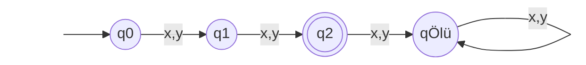

### DFA Geçiş Tablosu Nasıl Okunur?
Her zaman şekil çizemeyebiliriz, bu yüzden makineler tablolarla da ifade edilir. (Örnek 1'in tablosu)

| O Anki Durum | 'a' Okunursa | 'b' Okunursa |
|---|---|---|
| **$\rightarrow *q_0$** (Başlangıç ve Kabul) | $q_1$ | $q_0$ |
| **$q_1$** (Tek a) | $q_0$ | $q_1$ |

*(Tabloda $\rightarrow$ işareti Başlangıç, $*$ yıldız işareti ise Kabul durumunu belirtir.)*

---

## 3. Nondeterministik Sonlu Otomata (NFA)

**NFA (Kararsız Makine):** Adındaki "Nondeterministik" kelimesi "Belirsiz / Kararsız" demektir. Çok daha sihirli ve hayalperest bir makinedir. 
* Aynı harfi görünce aynı anda **farklı yollara** gidebilir (kendini kopyalayıp paralel evrenlerde arama yapar gibi).
* Ortada hiç harf yokken bile, görünmez bir köprüden geçer gibi ($\varepsilon$ - epsilon ile) bir durumdan diğerine atlayabilir (**ışınlanma**).
* Tasarlaması insanlar için çok kolaydır ancak bilgisayarlar bu kararsızlığı doğrudan anlayamaz (Arka planda NFA'lar her zaman bir DFA'ya dönüştürülerek çalıştırılır).

### NFA Örnekleri ve Tasarımları

**Örnek 6 — Işınlanma Sihri: Başında "a" veya "b" Gerekli (NFA):**
Bu makine başlangıçta aynı anda iki yola birden bakmak ister. Herhangi bir harf (a veya b) okumadan Epsilon ($\varepsilon$) gücüyle iki farklı kuralı eşzamanlı denemeye başlar.

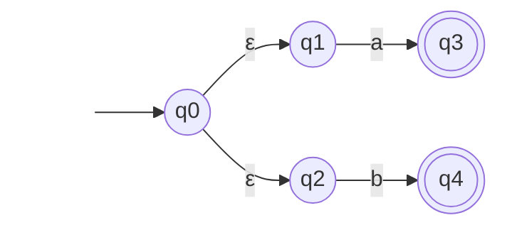
*Bu makine kelimenin ilk harfi 'a' ise $q_3$'te, 'b' ise $q_4$'te kabul verir.*

**Örnek 7 — Sondan Üçüncü Harfi '1' Olan Kelimeler (Alfabemiz 0,1):**
Bu NFA'nın klasik ve muhteşem bir örneğidir. "Geleceği görme" yeteneği gibi çalışır. Kelimenin neresinde olduğumuzu bilmeyiz, sürekli kelime gelir (0 veya 1). Ancak makine sondan üçüncü harfin 1 olduğunu "tahmin ederek" yola girer.

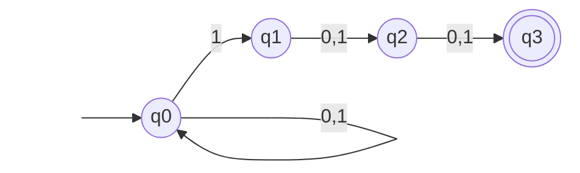
*DFA ile çizmeye kalksak 8 farklı durum ($2^3$) gerektirirken, NFA ile aynı anda farklı olasılıkları deneyerek sadece 4 durumla bu işi çözeriz.*

---

## 4. DFA ve NFA Arasındaki Temel Farklar

| Özellik | DFA (Deterministik) | NFA (Nondeterministik) |
|---|---|---|
| **Kararlılık** | Kesindir. Her durum ve harf kombinasyonunun tek bir hedefi vardır. | Kararsızdır. Bir durum/harf için birden fazla rota olabilir ya da hiç olmayabilir. |
| **Boş Geçiş (Epsilon $\varepsilon$)** | İzin verilmez. İlerlemek için mutlaka harf okumalıdır. | İzin verilir. Harf okumadan durum değiştirebilir ($\varepsilon$-NFA). |
| **Hız / Performans** | Hızlıdır. Kelimenin harf sayısı kadar adım atar ve biter. | Daha yavaştır (bilgisayar için). Girdiği tüm alternatif yolları (paralel evrenleri) simüle etmek zorundadır. |
| **Tasarım Kolaylığı** | Genellikle karmaşık kurallar için çizmesi daha zordur. | Tasarlaması insanın düşünce yapısına çok uyar, oldukça kolaydır. |

---

## 5. Çözümlü NFA Sınav Örnekleri

**Çözümlü Örnek 5 (NFA Çizimi):** $\Sigma = \{a, b\}$ alfabesinde, **sondan** ikinci harfi kesinlikle 'b' olan kelimeleri kabul eden bir NFA çiziniz. DFA yerine NFA kullanmanız çizimi nasıl kolaylaştırdı?

**Çözüm 5:** NFA, kelimenin bitme noktasına iki harf kaldığını kendi kendine "tahmin edebilir".
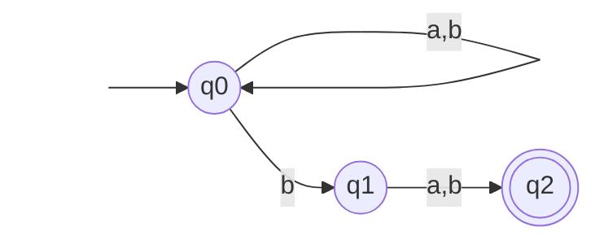
*Kolaylaştırma Nedeni:* Bunu DFA ile çizmeye kalksaydık, makinenin sürekli son iki harfi hatırlaması gerekeceği için $2^2 = 4$ durumlu daha karmaşık bir harita çizmek zorunda kalacaktık. NFA bu problemi ihtimalleri deneyerek sadece 3 durumla çözer.

**Çözümlü Örnek 6 (Kavram Testi):** NFA ile DFA arasındaki 2 temel farkı yazınız. Işınlanma (Boş geçiş / $\varepsilon$) NFA'da nasıl çalışır, DFA'da bu duruma neden izin verilmez kısaca açıklayınız.

**Çözüm 6:**
1. **Patinaj ve Belirsizlik:** DFA'da bir durumdayken alfabedeki her harf için gidebileceğiniz mutlaka ve SADECE TEK bir yol vardır. NFA'da ise yola çıkıp çıkmamak, veya aynı harfle birden fazla rotaya gitmek serbesttir.
2. **Işınlanma (Epsilon - $\varepsilon$):** NFA'lar, girdiden hiçbir harf okumadan (harcamadan) anında bir başka duruma kopyalanabilir. Buna Işınlanma ($\varepsilon$-geçişi) denir.
*DFA Neden İzin Vermez?* DFA, makinelerin ve bilgisayar programlarının somut donanım devrelerini (mantık kapılarını) temsil eder; fiziksel bir makine işlem yapmadan ya da girdi almadan eylem alamaz. NFA tasarımsal bir rahatlıktır, kodlanmadan önce teoride her zaman algoritma ile DFA'ya çevrilmelidir.
