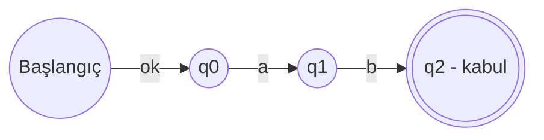
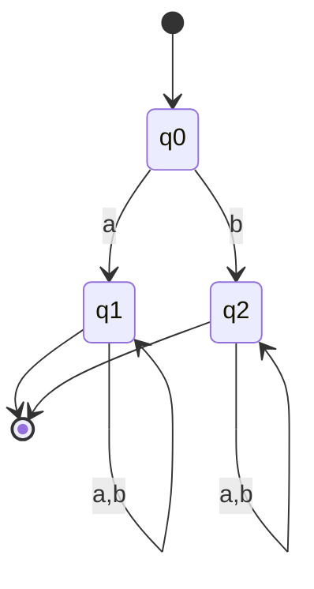
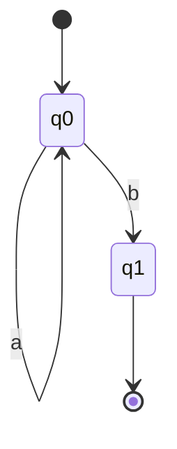
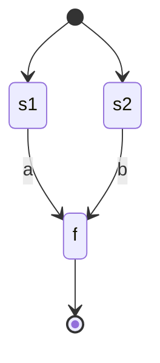

# Hafta 5: Geçiş Çizgeleri (Transition Graphs)

## 1. Giriş
Geçiş çizgesi (transition graph), bir otomatanın görsel gösterimidir. Durumlar düğüm (node), geçişler ise etiketli ok (edge) olarak gösterilir. NFA'larda kenar etiketleri kelime (string) de olabilir, sadece tek sembol olmak zorunda değildir.

## 2. Geçiş Çizgesi Bileşenleri
- **Düğümler (states):** daireler
- **Kenarlar (transitions):** etiketli oklar
- **Başlangıç durumu:** giriş oku ile gösterilir
- **Kabul durumları:** çift çember ile gösterilir

## 3. Örnekler

**Örnek 1 — Kelime etiketli geçiş çizgesi (Generalized Transition Graph):**
q0'dan q1'e "ab" etiketiyle doğrudan geçiş:

**Örnek 2 — Çoklu yol (birden fazla kabul durumu):**
"a" ile başlayan veya "b" ile biten dizeleri kabul eden çizge:

**Örnek 3 — Döngü (loop) içeren geçiş çizgesi:**
Aynı durumdan kendine dönen kenar (self-loop):

**Örnek 4 — ε-geçişli genelleştirilmiş çizge:**
İki alt otomatanın ε ile birleştirilmesi:

**Örnek 5 — Birden fazla başlangıçtan tek kabule giden çizge (NFA görünümü):**

## 4. Geçiş Çizgesinden Geçiş Tablosuna Dönüşüm
Örnek 3 için tablo:

| Durum | a | b |
|---|---|---|
| →q0 | q0 | q1 |
| *q1 | - | - |

## 5. Alıştırma Soruları
1. Örnek 2'deki geçiş çizgesinin kabul ettiği dili küme gösterimiyle yazınız.
2. "aab" veya "bba" kelimelerini kabul eden bir genelleştirilmiş geçiş çizgesi çiziniz.
3. Bir geçiş çizgesini geçiş tablosuna dönüştürme adımlarını açıklayınız.
4. ε-geçişlerin geçiş çizgelerinde neden kullanışlı olduğunu tartışınız.
