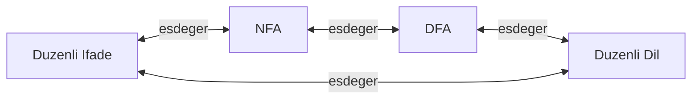
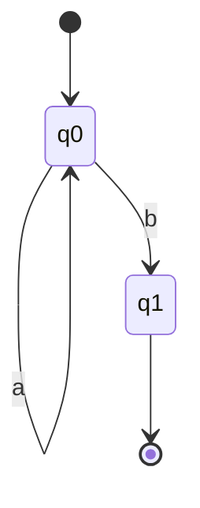
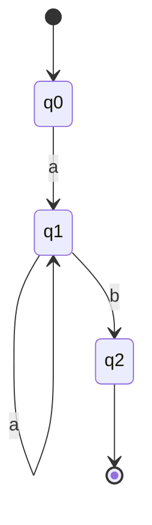
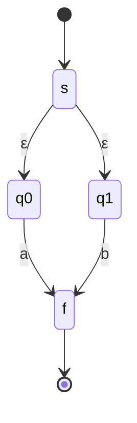
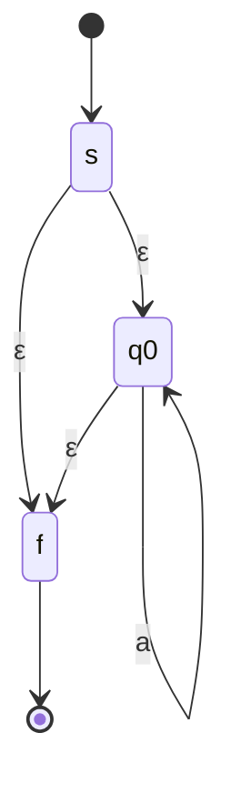

# Hafta 6: Kleene Teoremi

## 1. Giriş
Kleene Teoremi, **düzenli ifadelerin**, **sonlu otomataların (DFA/NFA)** ve **düzenli dillerin** birbirine eşdeğer (equivalent) olduğunu kanıtlar. Bu üç ifade biçimi aynı dil sınıfını tanımlar.

## 2. Teoremin Bölümleri
1. **Bölüm 1:** Her düzenli ifade bir NFA'ya dönüştürülebilir (Thompson İnşası).
2. **Bölüm 2:** Her NFA bir DFA'ya dönüştürülebilir (Alt Küme İnşası / Subset Construction).
3. **Bölüm 3:** Her DFA'dan bir düzenli ifade elde edilebilir (Durum Eleme Yöntemi / Arden's Lemma).

## 3. Örnekler

**Örnek 1 — Düzenli ifadeden NFA'ya (Thompson İnşası):**
r = a*b için:

**Örnek 2 — NFA'dan DFA'ya (Alt Küme İnşası):**
NFA durumları {q0}, {q0,q1} birleştirilerek DFA durumları oluşturulur.

| DFA Durumu | a | b |
|---|---|---|
| →{q0} | {q0} | {q1} |
| *{q1} | ∅ | ∅ |

**Örnek 3 — DFA'dan Düzenli İfadeye (Durum Eleme):**
Aşağıdaki DFA'dan q1 durumu elenerek düzenli ifade elde edilir:

q1 elendiğinde: q0 → q2 geçişi "aa*b" düzenli ifadesiyle etiketlenir.

**Örnek 4 — Birleşim işleminin NFA inşası:**
r = a+b için Thompson inşası, ε-geçişleriyle iki dala ayrılır:

**Örnek 5 — Kleene yıldızının NFA inşası:**
r = a* için:

## 4. Arden's Lemma
X = AX + B denkleminin çözümü (A, ε'yi içermiyorsa): **X = A*B**

Bu, DFA'daki her durumu bir denklemle ifade edip çözerek düzenli ifade bulmamızı sağlar.

## 5. Alıştırma Soruları
1. r = (ab)* için Thompson yöntemiyle NFA çiziniz.
2. 3 durumlu bir NFA'yı alt küme inşası ile DFA'ya çeviriniz (örnek seçiniz).
3. Arden's Lemma kullanarak 2 durumlu bir DFA'dan düzenli ifade türetiniz.
4. Kleene teoreminin pratikteki (derleyici tasarımı gibi) önemini açıklayınız.
