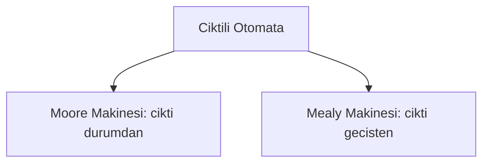
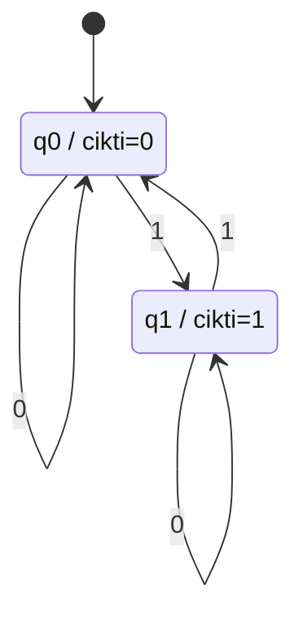
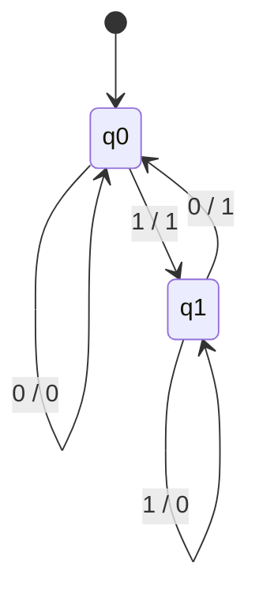
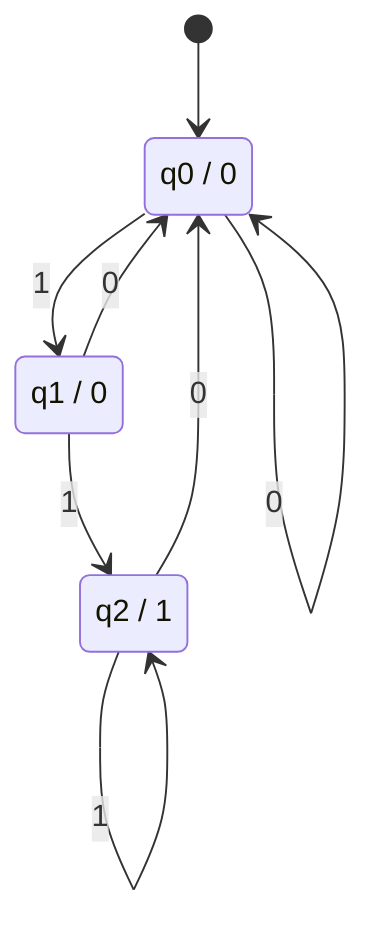
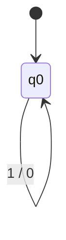

# Hafta 7: Çıktılı Sonlu Otomata (Mealy ve Moore Makineleri)

## 1. Giriş
Çıktılı sonlu otomata, sadece kabul/red kararı vermek yerine her adımda bir **çıktı** üreten makinelerdir. İki temel türü vardır:

- **Moore Makinesi:** çıktı, durumun bir fonksiyonudur → λ(q)
- **Mealy Makinesi:** çıktı, durum ve girdi sembolünün bir fonksiyonudur → λ(q, a)

## 2. Formal Tanımlar
**Moore:** M = (Q, Σ, Δ, δ, λ, q0)
**Mealy:** M = (Q, Σ, Δ, δ, λ, q0), λ: Q×Σ → Δ

Δ: çıktı alfabesi

## 3. Örnekler

**Örnek 1 — Moore Makinesi: ikili sayıda 1'lerin sayısını mod 2 gösteren makine:**

**Örnek 2 — Mealy Makinesi: son iki bitin XOR'unu üreten makine:**
Her geçişte, girdiye bağlı çıktı üretilir: 0/0, 1/1 gibi kenarlar üzerinde etiketlenir.

**Örnek 3 — Moore Makinesi: '11' alt dizesini sayan makine:**
Her '11' bulunduğunda çıktı 1, diğer durumlarda 0.

**Örnek 4 — Mealy Makinesi: girdi sembolünü tersine çeviren (NOT) makine:**
Tek durumlu, her girdi için tersini üreten basit çevirici.

**Örnek 5 — Mealy'den Moore'a dönüşüm:**
Mealy makinesindeki her (durum, çıktı) çifti, Moore makinesinde ayrı bir duruma bölünür.

| Mealy Durumu | Girdi | Yeni Durum | Çıktı |
|---|---|---|---|
| q0 | 0 | q0 | 0 |
| q0 | 1 | q1 | 1 |

Moore karşılığı: q0 (çıktı yok/başlangıç), q0_0 (çıktı=0), q1_1 (çıktı=1) gibi durumlara ayrıştırılır.

## 4. Moore vs Mealy Karşılaştırması
| Özellik | Moore | Mealy |
|---|---|---|
| Çıktı bağlı | Duruma | Durum + Girdiye |
| Durum sayısı | Genelde daha fazla | Genelde daha az |
| Çıktı gecikmesi | Bir adım gecikmeli olabilir | Anlık |

## 5. Alıştırma Soruları
1. Girdi dizisindeki 0 sayısını mod 3 hesaplayan bir Moore makinesi tasarlayınız.
2. "ab" alt dizesi geçtiğinde 1, aksi halde 0 çıktısı veren bir Mealy makinesi tasarlayınız.
3. Örnek 2'deki Mealy makinesini Moore makinesine dönüştürünüz.
4. Mealy ve Moore makinelerinin hangi uygulama alanlarında (örn. sayaçlar, kontrol devreleri) kullanıldığını araştırınız.
