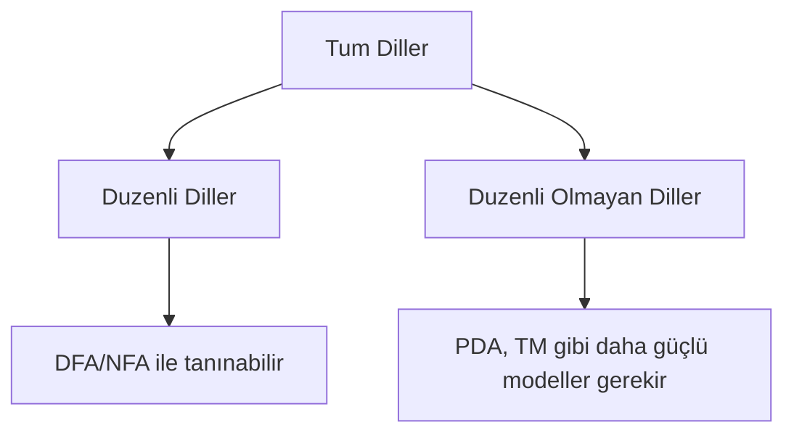
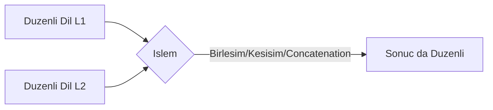

# Hafta 8: Düzenli ve Düzenli Olmayan Diller

## 1. Giriş
Bir dilin **düzenli (regular)** olup olmadığını belirlemek önemlidir. Düzenli diller sonlu otomata ile tanınabilirken, düzenli olmayan diller için bu mümkün değildir (sınırsız bellek gerektirir).

## 2. Pompalama Lemması (Pumping Lemma)
Bir L dili düzenliyse, bir n sabiti vardır öyle ki |w| ≥ n olan her w ∈ L, w = xyz şeklinde yazılabilir:
1. |xy| ≤ n
2. |y| ≥ 1
3. Her i ≥ 0 için xyⁱz ∈ L

Bu koşullardan biri sağlanmazsa dil **düzenli değildir**.

## 3. Örnekler

**Örnek 1 — Düzenli dil örneği:**
L1 = {w ∈ {a,b}* | w, "ab" ile biter} → düzenlidir, düzenli ifadesi: (a+b)*ab

**Örnek 2 — Düzenli olmayan klasik dil:**
L2 = {aⁿbⁿ | n ≥ 0} → düzenli değildir. Pompalama lemması ile ispat: n uzunluğunda kelime aⁿbⁿ seçilir, xy sadece a'lardan oluşur, y pompalanınca a sayısı artar ama b sayısı sabit kalır → dilden çıkar.

**Örnek 3 — Palindromlar dili düzenli değildir:**
L3 = {w | w = wᴿ} → sonlu belleğe sahip DFA, keyfi uzunlukta simetriyi kontrol edemez.

**Örnek 4 — Asal sayı uzunluğundaki diziler düzenli değildir:**
L4 = {aᵖ | p asal sayı} → Pompalama lemması ile düzensizliği kanıtlanabilir.

**Örnek 5 — Düzenli dil örneği (sonlu dil):**
L5 = {a, ab, abb} → her sonlu dil otomatik olarak düzenlidir (basit bir DFA ile kabul edilebilir).

**Örnek 6 — Eşit sayıda a ve b içeren dil düzenli değildir:**
L6 = {w | w'deki a sayısı = w'deki b sayısı} → sayaç sınırsız olduğundan sonlu durumla tutulamaz.

## 4. Düzenli Dillerin Kapanış Özellikleri (Closure Properties)
Düzenli diller şu işlemler altında kapalıdır:
- Birleşim (∪)
- Kesişim (∩)
- Tümleyen (complement)
- Birleştirme (concatenation)
- Kleene yıldızı (*)

## 5. Alıştırma Soruları
1. L = {aⁿb²ⁿ | n ≥ 0} dilinin düzenli olmadığını pompalama lemması ile kanıtlayınız.
2. L = {w ∈ {a,b}* | |w| ≤ 5} dilinin neden düzenli olduğunu açıklayınız.
3. İki düzenli dilin kesişiminin neden düzenli olduğunu (çarpım otomatası fikriyle) açıklayınız.
4. L = {ww | w ∈ {a,b}*} dilinin düzenli olup olmadığını tartışınız.
