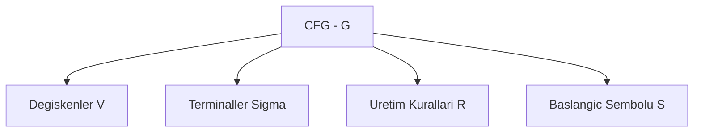
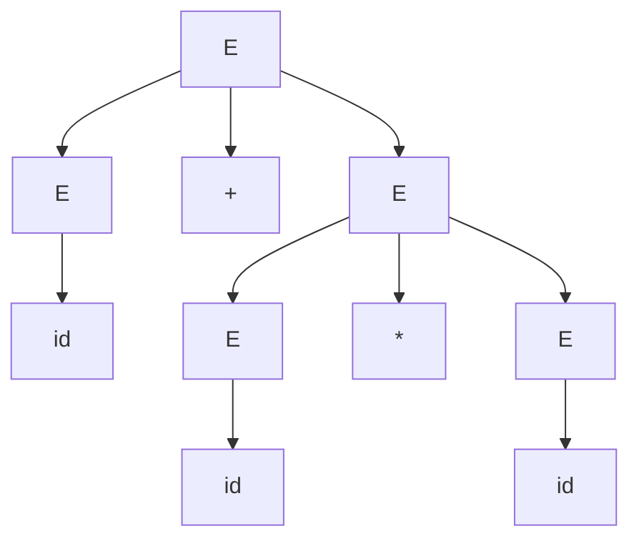

# Hafta 9: Durumdan Bağımsız (Context-Free) Dil Bilgileri

## 1. Giriş
Bağlamdan bağımsız gramer (Context-Free Grammar, CFG), düzenli dillerden daha güçlü bir dil sınıfını (Context-Free Languages, CFL) tanımlar. aⁿbⁿ gibi düzenli olmayan diller CFG ile ifade edilebilir.

## 2. Formal Tanım
G = (V, Σ, R, S)
- V: değişkenler (non-terminal) kümesi
- Σ: terminaller (alfabe)
- R: üretim kuralları (A → α, α ∈ (V∪Σ)*)
- S: başlangıç sembolü



## 3. Örnekler

**Örnek 1 — aⁿbⁿ dilini üreten gramer:**
```
S → aSb | ε
```
Türetim: S ⇒ aSb ⇒ aaSbb ⇒ aabb

**Örnek 2 — Dengeli parantez dili:**
```
S → (S)S | ε
```
Türetim: S ⇒ (S)S ⇒ (( S)S)S ⇒ (()) örneği için S ⇒ (S)S ⇒ ()S ⇒ ()

**Örnek 3 — Palindromlar (Σ={a,b}):**
```
S → aSa | bSb | a | b | ε
```
Türetim: S ⇒ aSa ⇒ abSba ⇒ abba

**Örnek 4 — Aritmetik ifadeler grameri:**
```
E → E+E | E*E | (E) | id
```
Türetim: E ⇒ E+E ⇒ id+E ⇒ id+E*E ⇒ id+id*id

**Örnek 5 — Eşit sayıda a ve b içeren dil:**
```
S → aSb | bSa | SS | ε
```

## 4. Türetim Ağacı (Parse Tree) Örneği
Örnek 4'teki "id+id*id" için türetim ağacı:



## 5. Solak / Sağak Türetim (Leftmost / Rightmost Derivation)
- **Soldan türetim:** her adımda en soldaki değişken genişletilir.
- **Sağdan türetim:** her adımda en sağdaki değişken genişletilir.

Belirsizlik (ambiguity): aynı kelime için birden fazla farklı türetim ağacı varsa gramer belirsizdir.

## 6. Alıştırma Soruları
1. {aⁿb²ⁿ | n≥0} dilini üreten bir CFG yazınız.
2. Örnek 4'teki gramerin "id+id+id" için soldan türetimini gösteriniz.
3. Örnek 2'deki gramerin "(()())" kelimesi için türetim ağacını çiziniz.
4. Bir gramerin ne zaman belirsiz (ambiguous) olduğunu örnekle açıklayınız.
