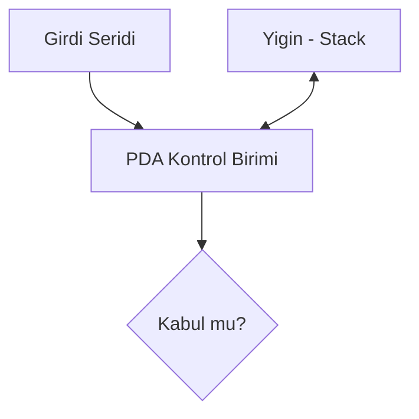
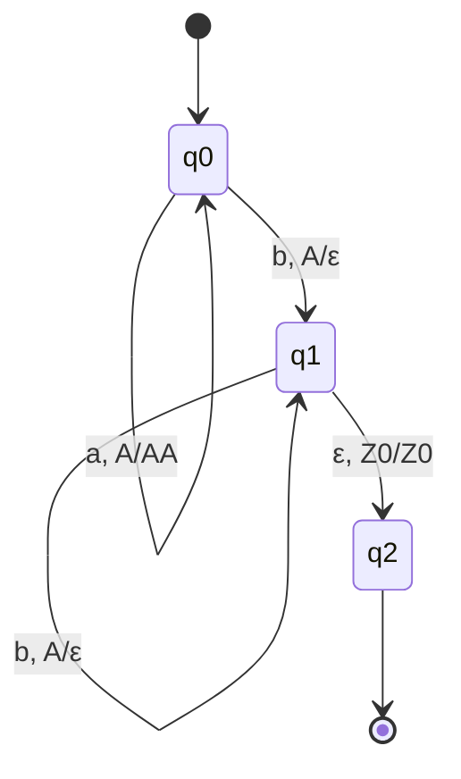
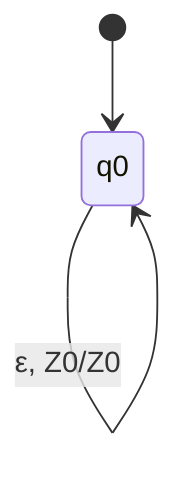
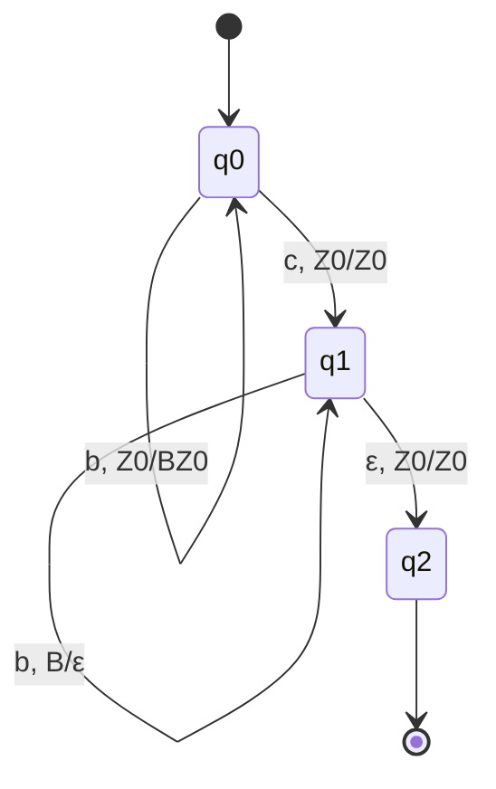
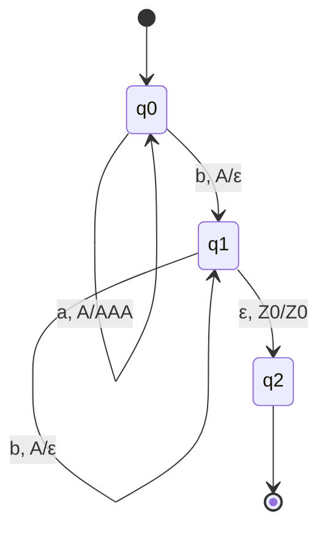

# Hafta 10: Push Down Otomata (PDA)

## 1. Giriş
Push Down Otomata (PDA), sonlu otomataya ek olarak bir **yığın (stack)** belleği içeren hesaplama modelidir. Bağlamdan bağımsız dilleri (CFL) tanıyabilir.

## 2. Formal Tanım
M = (Q, Σ, Γ, δ, q0, Z0, F)
- Q: durumlar
- Σ: girdi alfabesi
- Γ: yığın alfabesi
- δ: geçiş fonksiyonu (Q×Σ∪{ε}×Γ → Q×Γ*)
- q0: başlangıç durumu
- Z0: yığının başlangıç sembolü
- F: kabul durumları

## 3. Örnekler

**Örnek 1 — aⁿbⁿ dilini kabul eden PDA:**
Her 'a' için yığına push, her 'b' için pop yapılır; yığın boşalınca kabul.

**Örnek 2 — Dengeli parantez PDA:**
'(' için push, ')' için pop işlemi yapılır.

**Örnek 3 — Palindrom (ortası bilinen, wcwᴿ) kabul eden PDA:**
İlk yarıda push, 'c' ortasında geçiş, ikinci yarıda pop yapılarak eşleşme kontrol edilir.

**Örnek 4 — Eşit sayıda a ve b içeren dizeleri kabul eden PDA:**
Yığında sayaç mantığıyla fazlalık a veya b tutulur; sonunda yığın Z0'a dönmelidir.

**Örnek 5 — {aⁿb²ⁿ | n≥0} dilini kabul eden PDA:**
Her 'a' için 2 sembol push edilir, her 'b' için 1 sembol pop edilir.

## 4. Kabul Türleri
- **Boş yığınla kabul (acceptance by empty stack)**
- **Son durumla kabul (acceptance by final state)**

Bu iki yöntem birbirine dönüştürülebilir ve eşdeğerdir.

## 5. PDA ile CFG Arasındaki İlişki
Her CFG için eşdeğer bir PDA, her PDA için eşdeğer bir CFG oluşturulabilir (yapısal eşdeğerlik).

## 6. Alıştırma Soruları
1. {wwᴿ | w ∈ {a,b}*} dilini kabul eden bir PDA tasarlayınız.
2. Örnek 1'deki PDA'nın "aaabbb" girdisini adım adım işleyerek kabul ettiğini gösteriniz.
3. Boş yığınla kabul ile son durumla kabul arasındaki farkı açıklayınız.
4. {aⁿbᵐ | n≠m} dilini kabul eden bir PDA fikri tasarlayınız.
