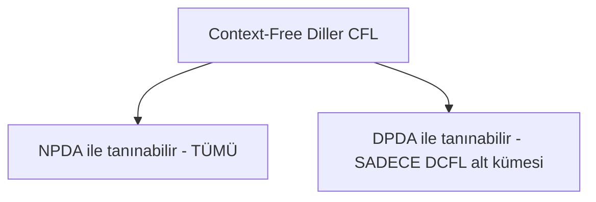
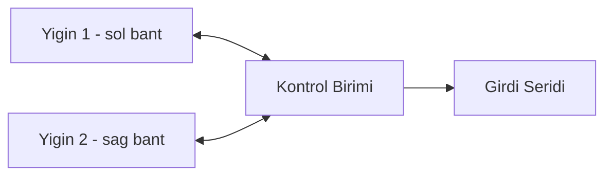

# Hafta 11: Yığıtlı Otomata (İleri Düzey PDA Konuları)

## 1. Giriş
Bu hafta, yığıtlı otomataların (Stack Automata) daha ileri özelliklerini, determinist olmayan ve determinist PDA (DPDA) farklarını ve yığın işlemlerinin dil gücüne etkisini inceliyoruz.

## 2. Determinist PDA (DPDA) vs Non-Determinist PDA (NPDA)
- **DPDA:** her konfigürasyon için en fazla bir geçiş vardır.
- **NPDA:** birden fazla geçiş mümkün olabilir.
- **Önemli fark:** NPDA, DPDA'dan daha güçlüdür (her CFL, NPDA ile tanınır ama her CFL DPDA ile tanınamaz).

## 3. Örnekler

**Örnek 1 — DPDA ile tanınabilen dil: aⁿbⁿ:**
Bu dil deterministiktir çünkü her adımda hangi işlemi yapacağı bellidir (push a'larda, pop b'lerde).

**Örnek 2 — DPDA ile tanınamayan dil: palindromlar {wwᴿ}:**
Kelimenin ortası bilinmediği için (nerede push'tan pop'a geçileceği belirsiz) bu dil sadece NPDA ile tanınabilir, DPDA ile tanınamaz.

**Örnek 3 — Çok yığınlı otomata (2-stack PDA) ile Turing gücü:**
İki yığınlı bir otomata, bir Turing makinesine eşdeğer hesaplama gücüne sahiptir (biri sağ bant, biri sol bant gibi kullanılabilir).

**Örnek 4 — Yığın derinliği sınırlı otomata (k-sınırlı PDA):**
Yığın derinliği sabit bir k ile sınırlıysa, bu otomata bir sonlu otomataya eşdeğerdir (çünkü olası konfigürasyon sayısı sonlu hale gelir).

**Örnek 5 — İki taraflı sayaç dilini (aⁿbⁿcⁿ) PDA ile tanıyamama:**
aⁿbⁿcⁿ dili context-free değildir; tek yığınlı bir PDA ile tanınamaz çünkü iki bağımsız sayaç eşzamanlı tutulamaz.

## 4. Yığın İşlemlerinin Gücü Karşılaştırması
| Model | Bellek Türü | Tanıdığı Dil Sınıfı |
|---|---|---|
| DFA/NFA | Yok (sonlu durum) | Düzenli Diller |
| PDA (1 yığın) | 1 yığın | Context-Free Diller |
| 2 Yığınlı Otomata | 2 yığın | Turing-tanınabilir diller |
| Turing Makinesi | Sınırsız bant | Turing-tanınabilir diller |

## 5. CFL Kapanış Özellikleri
CFL'ler şu işlemler altında kapalıdır: birleşim, birleştirme, Kleene yıldızı.
CFL'ler şu işlemler altında **kapalı değildir**: kesişim, tümleyen (genel olarak).

## 6. Alıştırma Soruları
1. aⁿbⁿcⁿ dilinin neden context-free olmadığını (pompalama lemması CFL versiyonuyla) tartışınız.
2. DPDA ile NPDA arasındaki gücün neden farklı olduğunu bir örnekle açıklayınız.
3. İki yığınlı otomatanın Turing makinesine neden eşdeğer olduğunu kısaca açıklayınız.
4. Context-free dillerin kesişim altında neden kapalı olmadığını bir örnekle gösteriniz.
