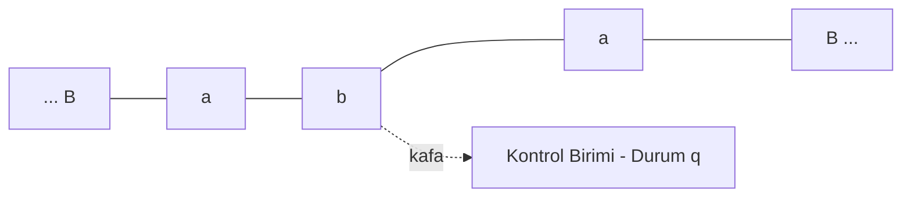
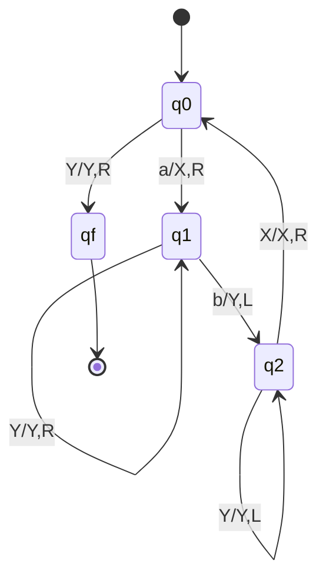
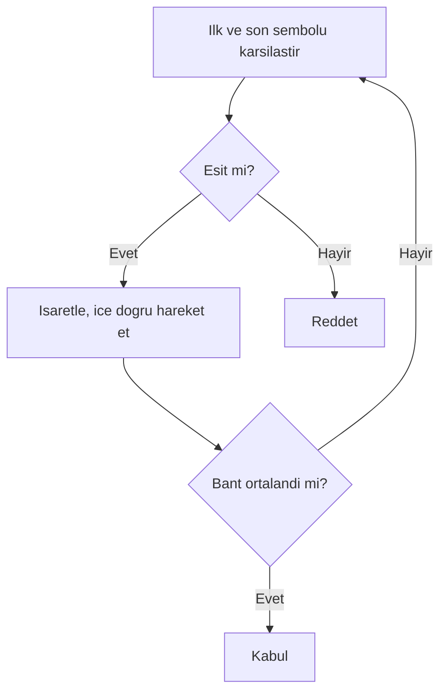
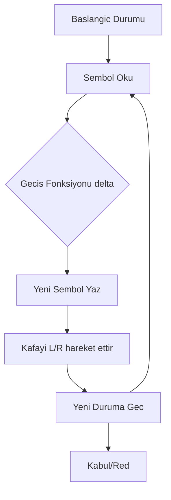

# Hafta 12: Turing Makineleri (TM)

## 1. Giriş
Turing Makinesi (TM), en genel hesaplama modelidir. Sınırsız uzunlukta bir bant, bant üzerinde hareket eden bir kafa (head) ve okuma/yazma yeteneği içerir.

## 2. Formal Tanım
M = (Q, Σ, Γ, δ, q0, B, F)
- Q: durumlar
- Σ: girdi alfabesi
- Γ: bant alfabesi (Σ ⊆ Γ)
- δ: geçiş fonksiyonu (Q×Γ → Q×Γ×{L,R})
- q0: başlangıç durumu
- B: boşluk sembolü (blank)
- F: kabul durumları

## 3. Örnekler

**Örnek 1 — aⁿbⁿ dilini tanıyan TM:**
Strateji: her adımda bir 'a' işaretlenir (X ile), karşılık gelen bir 'b' işaretlenir (Y ile); tüm semboller eşleşince kabul.

**Örnek 2 — İkili sayıyı 1 artıran TM:**
Bant üzerinde sağdan sola giderek, ilk 0'ı 1 yapan, geçtiği 1'leri 0'a çeviren basit bir toplama makinesi.

**Örnek 3 — Palindrom kontrolü yapan TM:**
İlk ve son sembol karşılaştırılır, eşleşirse işaretlenir, kafa içe doğru hareket eder; tüm semboller eşleşirse kabul.

**Örnek 4 — aⁿbⁿcⁿ dilini tanıyan TM:**
Her tur bir a, bir b, bir c işaretlenir; üç sembol de eşit sayıda işaretlenirse kabul edilir (PDA'nın yapamadığı bir işlem, TM'nin yapabildiğini gösterir).

**Örnek 5 — İkili sayının kopyasını (w#w) üreten/kontrol eden TM:**
'#' işaretini bulur, sol ve sağ kısmı sembol sembol karşılaştırır.

## 4. Turing Makinesinin Çalışma Şeması

## 5. TM Türleri
- **Deterministik TM (DTM)**
- **Non-deterministik TM (NTM)** — DTM'ye eşdeğer güçtedir
- **Çok bantlı TM** — tek bantlı TM'ye eşdeğer güçtedir
- **Evrensel Turing Makinesi (UTM)** — her TM'yi simüle edebilen TM

## 6. Alıştırma Soruları
1. Örnek 1'deki TM'nin "aabb" girdisini adım adım işleyerek kabul ettiğini gösteriniz.
2. Bir sayıyı ikiye katlayan (örn: bant üzerindeki 1'lerin sayısını ikiye katlayan) bir TM tasarlayınız.
3. Çok bantlı TM'nin neden tek bantlı TM'ye eşdeğer olduğunu kısaca açıklayınız.
4. Evrensel Turing Makinesi kavramının modern bilgisayarlarla ilişkisini tartışınız.
