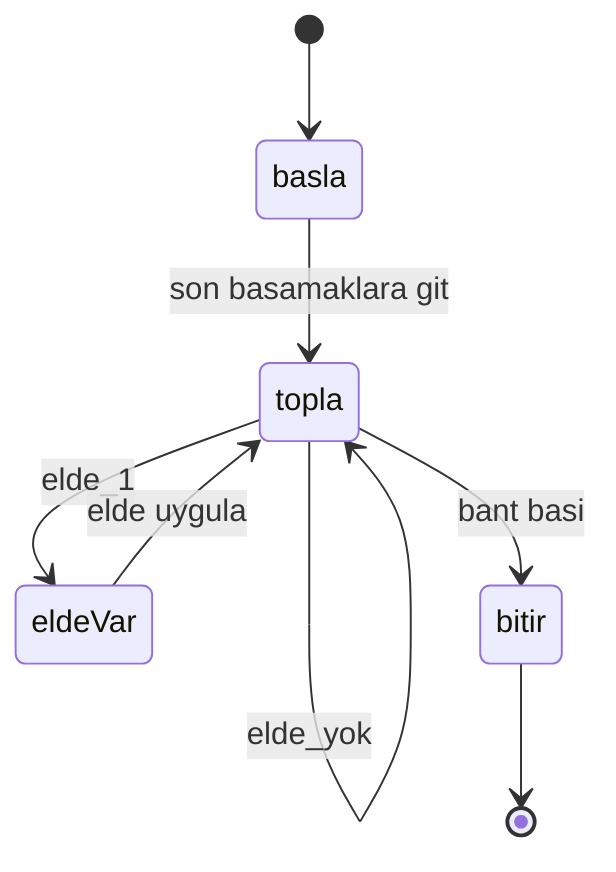
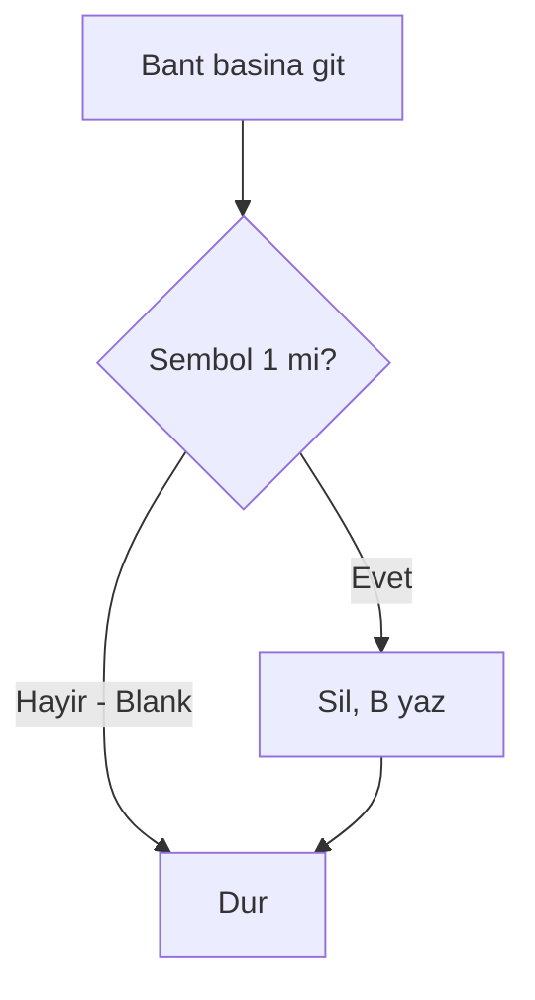
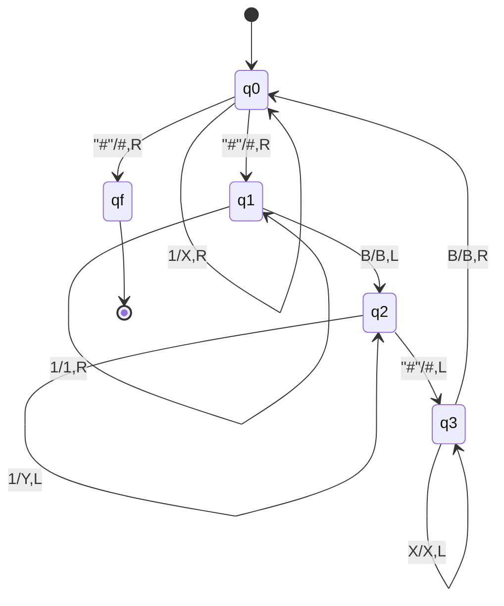
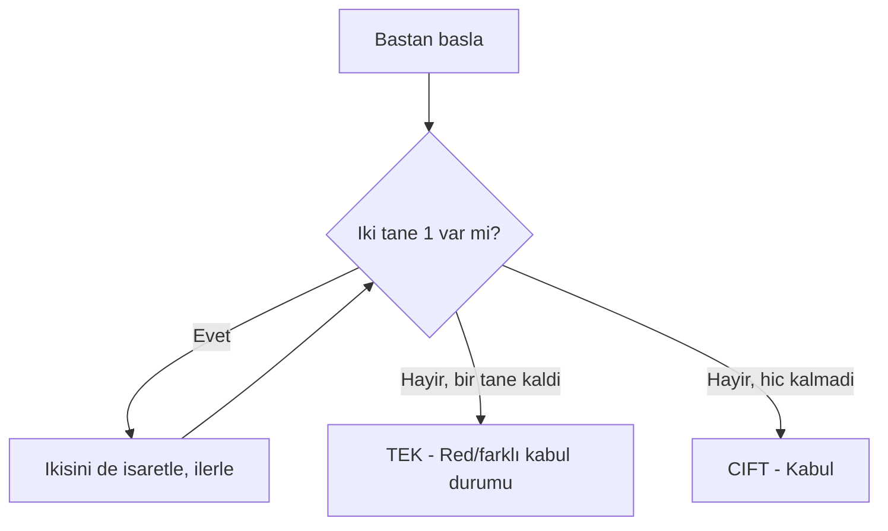
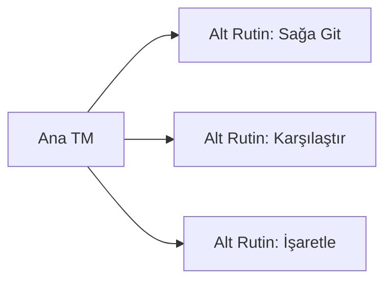

# Hafta 13: Turing Makine Örnekleri I

## 1. Giriş
Bu hafta, Turing makinelerinin çeşitli hesaplama görevlerinde nasıl kullanıldığını somut örneklerle inceliyoruz: aritmetik işlemler, dizi işleme ve karar problemleri.

## 2. Örnekler

**Örnek 1 — İkili toplama yapan TM (A + B):**
İki ikili sayı '#' ile ayrılmış olarak bant üzerinde verilir. TM, sağdan sola doğru elde (carry) tutarak toplama yapar.

**Örnek 2 — Bir dizideki sembolleri silen (unary sayı azaltma) TM:**
Girdi: 1ⁿ (n tane 1). TM her çalıştığında bir 1'i siler ve n-1 uzunluğunda yeni bir dizi bırakır.

**Örnek 3 — İki sayının eşit olup olmadığını kontrol eden TM (unary):**
1ⁿ#1ᵐ girdisi verilir. Her iki taraftan bir 1 işaretlenir, n=m ise kabul.

**Örnek 4 — Bir dizinin tersini alan (reverse) TM:**
Girdi w, çıktı wᴿ. TM, sağdan sola sembolleri okuyup yeni bir alana ters sırayla yazar.

**Örnek 5 — Bir sayının çift mi tek mi olduğunu kontrol eden TM (unary sayı üzerinde):**
1ⁿ girdisi verilir; TM ikişer ikişer 1'leri işaretleyerek n'nin çift/tek olduğunu belirler.

## 3. Alt Rutin (Subroutine) Kavramı
Karmaşık TM'ler, daha küçük TM'lerin (alt rutinlerin) birleştirilmesiyle inşa edilir. Örneğin "sağa git ve ilk boşluğu bul" gibi işlemler ayrı bir alt makine olarak tasarlanıp ana makineye eklenebilir.

## 4. Alıştırma Soruları
1. Örnek 1'deki toplama makinesinin "101#11" girdisini (5+3=8) adım adım işlemesini gösteriniz.
2. Örnek 3'teki eşitlik kontrol TM'sinin "111#11" girdisinde neden reddettiğini açıklayınız.
3. Bir sayıyı 2'ye bölen (unary) bir TM tasarlayınız.
4. Alt rutin yaklaşımının TM tasarımını neden kolaylaştırdığını açıklayınız.
