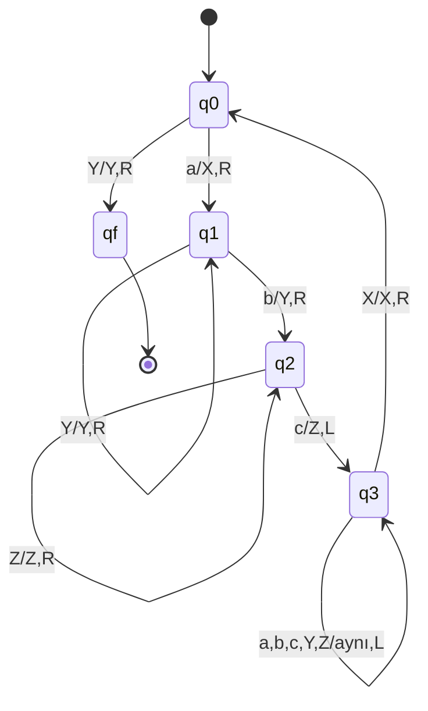
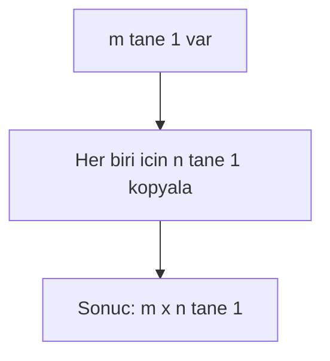
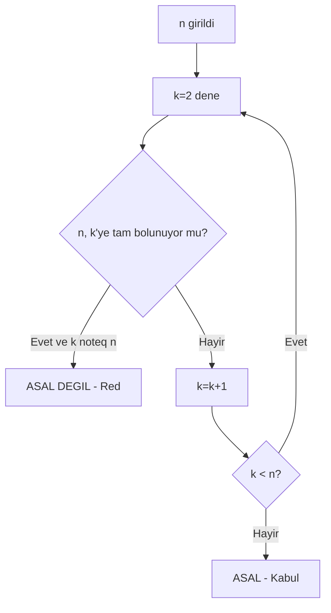
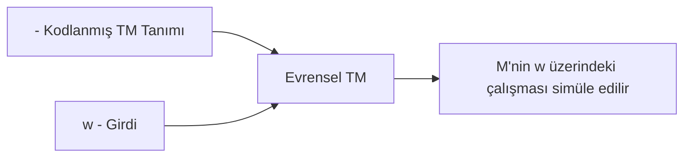
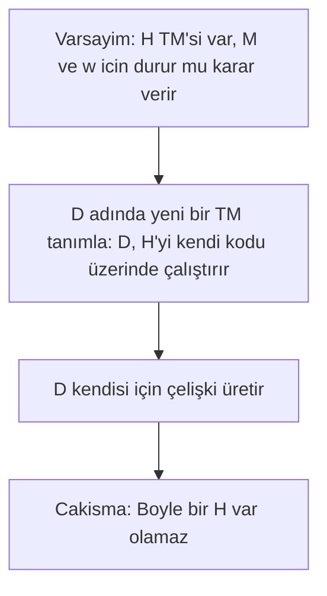
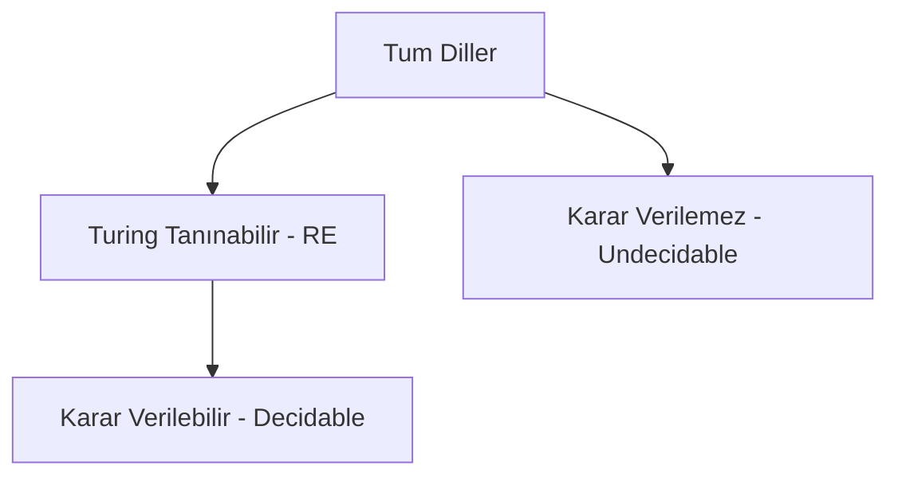

# Hafta 14: Turing Makine Örnekleri II

## 1. Giriş
Bu son haftada, daha ileri düzey Turing makinesi örneklerini, karar verilebilirlik (decidability) kavramını ve Turing makinelerinin sınırlarını inceliyoruz.

## 2. Örnekler

**Örnek 1 — aⁿbⁿcⁿ dilini tanıyan TM (detaylı):**
Her turda bir 'a', bir 'b', bir 'c' işaretlenir (X, Y, Z sembolleriyle). Eşit sayıda değilse reddedilir.

**Örnek 2 — Çarpma yapan TM (unary çarpım, m×n):**
1ᵐ#1ⁿ girdisi verilir; TM, n'i m kez kopyalayarak 1^(m×n) sonucunu üretir.

**Örnek 3 — Asal sayı testi yapan TM (unary sayı üzerinde):**
1ⁿ girdisi verilir. TM, n'nin 2'den n-1'e kadar herhangi bir sayıya bölünüp bölünmediğini (tekrarlı çıkarma ile) kontrol eder.

**Örnek 4 — Evrensel Turing Makinesi (UTM) simülasyonu:**
UTM, bir TM'nin kodlanmış tanımını ve girdisini alır, o TM'yi simüle eder. Bu, "her algoritma bir TM ile ifade edilebilir" fikrinin (Church-Turing Tezi) temelidir.

**Örnek 5 — Durma Problemi (Halting Problem) — Karar Verilemezlik:**
"Bir TM'nin belirli bir girdide durup durmayacağını genel olarak belirleyen bir algoritma yoktur." Bu, Turing tarafından çelişki (diagonalization) yöntemiyle ispatlanmıştır.

## 3. Karar Verilebilir vs Tanınabilir Diller

| Sınıf | Tanım |
|---|---|
| **Karar verilebilir (Decidable)** | Her girdide TM durur ve doğru cevap verir |
| **Tanınabilir (Recognizable/RE)** | Kabul edilen girdilerde durur, reddedilenlerde durmayabilir |
| **Karar verilemez (Undecidable)** | Durma Problemi gibi, hiçbir TM her zaman doğru cevap veremez |

## 4. Alıştırma Soruları
1. Örnek 1'deki TM'nin "aabbcc" girdisini kabul ettiğini adım adım gösteriniz.
2. Örnek 3'teki asal sayı testi TM'sinin n=6 için neden reddettiğini açıklayınız.
3. Durma Probleminin neden karar verilemez olduğunu kendi cümlelerinizle özetleyiniz.
4. Karar verilebilir ve tanınabilir dil sınıfları arasındaki farkı bir örnekle açıklayınız.
